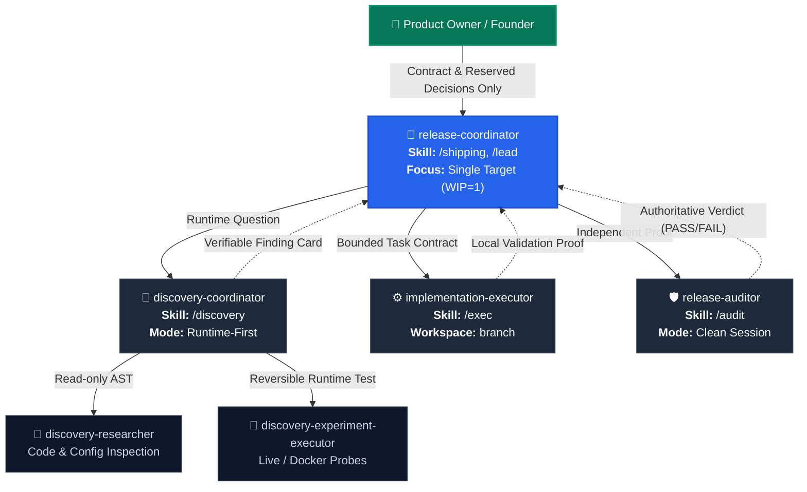
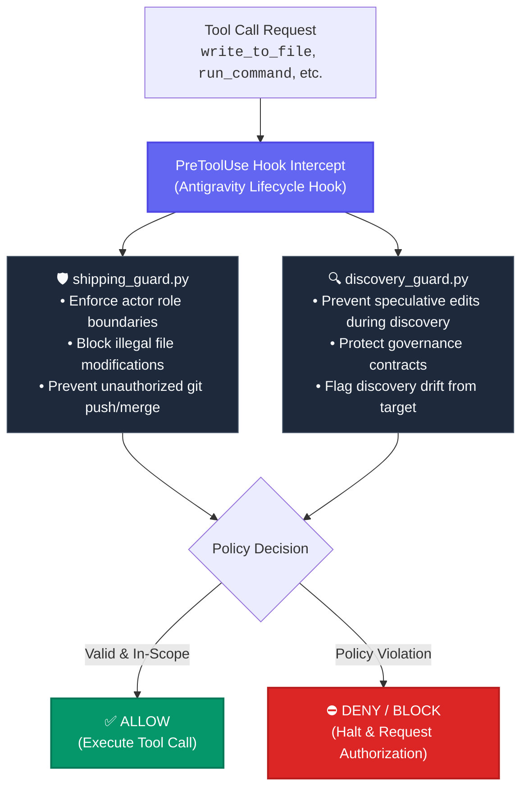

# 🚀 Labeeb Shipping Mode v2.1 — Agent-Native Release Architecture

[](https://antigravity.google)
[](./VERSION)
[](./payload/.agents)
[](./CHANGELOG.md)

**Labeeb Shipping Mode v2.1** is a complete, production-grade autonomous agent architecture for Google Antigravity IDE. Built strictly on the official Antigravity extension standards (Plugins, Skills, Custom Subagents, Rules, and Hooks), it transforms release management and debugging into an autonomous, evidence-driven, multi-agent engine.

---

## 🏗️ Architectural Overview (Developer Perspective)



### Why Agent-Native v2.1?
1. **Zero Human Relay**: The Product Owner is no longer a manual message bus between agent sessions. The `release-coordinator` autonomously orchestrates subagents and returns only when a reserved decision is required.
2. **True Context Isolation**: Each subagent runs in its own bounded context window (`inherit` or `branch` workspace mode), preventing prompt bloat and hallucination accumulation.
3. **Evidence Over Speculation**: Code changes are strictly forbidden without reproducible, empirical runtime proof. A passing test suite or git commit alone never equals a release criterion `PASS`.
4. **Active Hook Security**: System-level hooks intercept every file edit and bash command before execution, enforcing actor boundaries, preventing discovery drift, and guarding governance assets.

---

## 📦 Package Structure & Topology

```
labeeb-shipping-mode-v2/
├── VERSION                          # Version identifier (v2.1.0)
├── CHANGELOG.md                     # Comprehensive release changelog
├── SOURCES.md                       # Antigravity official specification references
├── apply.sh                         # Atomic installer with automatic backup
├── rollback.sh                      # Zero-loss rollback script
├── verify.sh                        # Standalone package validation test runner
├── verify-install.sh                # Post-installation workspace verification
└── payload/                         # Core system payload
    ├── .agents/
    │   ├── agents/                  # Standalone Custom Subagent Profiles
    │   │   ├── release-coordinator/
    │   │   ├── discovery-coordinator/
    │   │   ├── discovery-researcher/
    │   │   ├── discovery-experiment-executor/
    │   │   ├── implementation-executor/
    │   │   └── release-auditor/
    │   └── plugins/
    │       └── labeeb-shipping-mode/ # Antigravity Plugin Bundle
    │           ├── plugin.json       # Plugin manifest & metadata
    │           ├── hooks.json        # PreToolUse & Stop lifecycle hooks
    │           ├── rules/            # Model-decision invariants
    │           │   ├── evidence-invariants.md
    │           │   └── shipping-invariants.md
    │           ├── skills/           # Slash-command skill definitions
    │           │   ├── shipping/     # /shipping
    │           │   ├── lead/         # /lead, /delivery-lead
    │           │   ├── discovery/    # /discovery
    │           │   ├── exec/         # /exec, /executor
    │           │   └── audit/        # /audit, /auditor
    │           ├── scripts/          # Guard & reconciliation Python engine
    │           │   ├── shipping_guard.py
    │           │   ├── discovery_guard.py
    │           │   ├── discovery_drift.py
    │           │   └── discovery_stop.py
    │           └── tests/            # Automated guard & hook test suites
    └── tasks/
        └── release-v0.1/            # Release Governance & Control Plane
            ├── 00_RELEASE_CONTROL.md
            ├── 01_RELEASE_CONTRACT.md
            ├── 02_OPERATING_MANUAL.md
            ├── 03_DELEGATION_RECORD.md
            ├── 04_ROLE_PROMPTS.md
            └── sprints/sprint_S01.md
```

---

## ⚡ Specialized Subagent Profiles

| Subagent Profile | Primary Skill | Workspace Strategy | Capabilities & Invariants |
|---|---|:---:|---|
| **`release-coordinator`** | `/shipping` | `inherit` | Inspects release contracts, tracks `WIP = 1`, manages proof targets, delegates to specialized subagents, and generates briefings. **Forbidden from writing production code.** |
| **`discovery-coordinator`** | `/discovery` | `inherit` | Drives runtime-first failure isolation. Establishes canonical entrypoints, traces proof boundaries, and produces verifiable Finding Cards. |
| **`discovery-researcher`** | — | `inherit` | Narrow, read-only code and configuration investigator. Operates under AST inspection without modifying workspace state. |
| **`discovery-experiment-executor`** | — | `inherit` | Runs bounded, reversible local test scripts against Docker or live endpoints. Strictly forbidden from changing code or running migrations. |
| **`implementation-executor`** | `/exec` | `branch` | Receives a frozen `task_contract` and implements the minimal required fix accompanied by local validation. **Forbidden from self-auditing or git push/merge.** |
| **`release-auditor`** | `/audit` | `inherit` | Independent verifier in a pristine session. Re-executes the original user journey and issues an authoritative `PASS`, `FAIL`, `BLOCKED`, or `UNKNOWN`. |

---

## 🛡️ Active Security & Guard Rails (Hooks Engine)

The system embeds an intelligent Python security engine in `.agents/plugins/labeeb-shipping-mode/scripts/`:



---

## 🛠️ Developer Installation & Verification

### 1. Pre-Flight Package Verification
Validate all JSON manifests, Python AST syntax, guard policies, skill headers, and agent manifests before deployment:
```bash
./verify.sh
```
*Expected Output:* `PACKAGE_VERIFY=PASS`

### 2. Install into Target Project Workspace
Deploy plugin, standalone subagents, and governance templates with automatic timestamped backup:
```bash
./apply.sh /path/to/target/project
```
*Output includes backup location and verification confirmation:* `MIGRATION_STATE=PASS`

### 3. Verify Installed Workspace
Confirm that all 6 subagents, 9 skills, 2 rules, hooks, and release templates are properly registered and passing tests in the target workspace:
```bash
./verify-install.sh /path/to/target/project
```
*Expected Output:* `INSTALL_VERIFY=PASS`

### 4. Zero-Loss Rollback
If you ever need to restore your workspace to its exact pre-migration state:
```bash
./rollback.sh /path/to/target/project /path/to/target/project/.migration-backups/labeeb-shipping-mode-v2-[TIMESTAMP]
```

---

## 🎮 Daily Workflow & Operational Commands

### The Single Daily Command
Simply type in Antigravity chat:
```text
/shipping
```
The `release-coordinator` will:
1. Load [01_RELEASE_CONTRACT.md](file:///home/hany/webserver/server/www/labeeb2025/labeeb-shipping-mode-v2/payload/tasks/release-v0.1/01_RELEASE_CONTRACT.md) and [00_RELEASE_CONTROL.md](file:///home/hany/webserver/server/www/labeeb2025/labeeb-shipping-mode-v2/payload/tasks/release-v0.1/00_RELEASE_CONTROL.md).
2. Determine the next unproven failure boundary.
3. Delegate to `discovery-coordinator`, `implementation-executor`, or `release-auditor` autonomously.
4. Escalate **strictly 4 reserved founder decisions**:
   - Release contract or core product scope changes.
   - Material security, legal, or financial risks.
   - Major foundational architecture overhauls.
   - Final public release Go / No-Go decision.

---

## 📚 Official Antigravity References

Built in full compliance with Antigravity official specifications:
- **Workflows to Skills**: [antigravity.google/docs/migration/workflows-to-skills](https://antigravity.google/docs/migration/workflows-to-skills)
- **Plugins Architecture**: [antigravity.google/docs/plugins](https://antigravity.google/docs/plugins)
- **Custom Subagents Specification**: [antigravity.google/docs/subagents](https://antigravity.google/docs/subagents/)
- **Model-Decision Rules**: [antigravity.google/docs/rules](https://antigravity.google/docs/rules/)
- **Hooks & PreToolUse Lifecycle**: [antigravity.google/docs/hooks](https://antigravity.google/docs/hooks)
