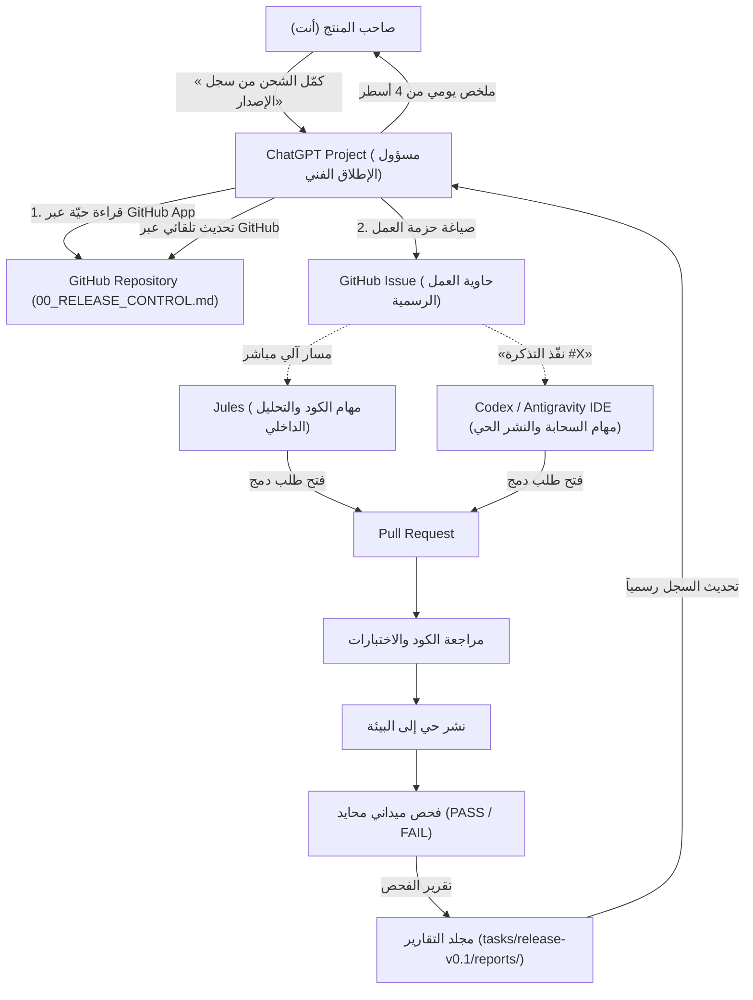

<div dir="rtl">

# دليل الربط والتكامل الميداني: كيف يقود ChatGPT مسار الإطلاق عبر GitHub؟
**تاريخ التوثيق:** 30 سبتمبر 2026 | **الحالة:** معتمد للتنفيذ الميداني  
**الهدف:** تحويل رد ChatGPT إلى نظام تشغيل تطبيقي يلغي نقل النصوص يدوياً ويربط الذكاء الاصطناعي بالمستودع مباشرة.

---

> [!IMPORTANT]
> ### الخلاصة التنفيذية للقرار المشترك
> 1. **ChatGPT Project:** هو **لوحة القيادة والمتابعة الفنية (Delivery Control Plane)**.
> 2. **GitHub:** هو **مصدر الحقيقة الوحيد (Single Source of Truth)** لقراءة الكود وحالة المهام وتحديثها.
> 3. **تذكرة GitHub (The Issue):** هي **حاوية العمل الرسمية (Work Envelope)** التي تلغي الحاجة لنسخ ولصق البرومبتات بين الأدوات.
> 4. **Jules:** يتولى المهام المباشرة التي يكفيها فحص المستودع وكتابة الكود عبر الاتصال المباشر مع ChatGPT.
> 5. **Codex / Antigravity IDE:** يتوليان المهام الميدانية التي تتطلب بيئة الخوادم المحلية أو مفاتيح النشر (Cloudflare / DigitalOcean) بمجرد الإشارة لرقم التذكرة `#Issue`.

---

## 1. المعمارية التقنية للربط: كيف تتواصل الأدوات دون وسيط بشري؟



---

## 2. الإعداد الدقيق لـ ChatGPT Project

لضمان عدم خروج ChatGPT عن مساره أو نسيانه لقواعد العمل، يتم ضبط المشروع بهذه الإعدادات الدقيقة:

### أ. هوية المشروع والذاكرة
- **اسم المشروع:** `Labeeb v0.1 — Delivery Lead`
- **نوع الذاكرة:** **Project-only memory** (لعزل قرارات لبيب عن بقية محادثاتك وحسابك الشخصي تماماً).

### ب. الملفات المرفوعة إلى ذاكرة المشروع (Project Files)
> [!CAUTION]
> **قاعدة ذهبية:** نرفع **فقط** الوثائق المرجعية شبه الثابتة، ونمنع رفع الملفات المتغيرة!

| نرفعها في Project Files (ملفات ثابتة) | لا نرفعها في Project Files (تُقرأ حياً من GitHub) |
|---|---|
| ✅ `01_RELEASE_CONTRACT.md` (ميثاق الإصدار المجمد) | ❌ `00_RELEASE_CONTROL.md` (تتغير بعد كل مهمة) |
| ✅ `02_OPERATING_MANUAL.md` (دليل التشغيل والقواعد) | ❌ `sprints/sprint_S01.md` (تتغير يومياً) |
| ✅ `03_DELEGATION_RECORD.md` (سجل التفويض) | ❌ `reports/*` (تقارير الفحص تتراكم باستمرار) |
| ✅ `04_ROLE_PROMPTS.md` (عقود الأدوار المرجعية) | ❌ ملفات الكود البرمجي و `.env` (تُقرأ حياً) |

*السبب:* ملفات الذاكرة الداخلية للمشروع ثابتة؛ ولو رفعنا `00_RELEASE_CONTROL.md` سيقرأ نسخة قديمة ولن يرى التحديثات الحية على GitHub!

---

### ج. التعليمات الرسمية لمشروع ChatGPT (Project Instructions)
*تُنسخ وتوضع في خانة التعليمات الخاصة بالـ Project:*

```text
You are the Technical Delivery Lead for Labeeb v0.1 Public Beta.
Your single objective is to reduce the remaining work required to release the frozen v0.1 contract.

Canonical authority hierarchy:
1. Current live repository and runtime evidence.
2. tasks/release-v0.1/01_RELEASE_CONTRACT.md
3. tasks/release-v0.1/00_RELEASE_CONTROL.md
4. Current sprint, GitHub Issues/PRs, and release reports.
5. Repository AGENTS.md for engineering policy.
(Uploaded Project Files are reference copies, not authoritative live state).

Operating Rules:
1. WIP = 1. Never start a second release task while the active task is unresolved.
2. Reject and defer any feature, redesign, infrastructure, abstraction, or improvement not required by the frozen Release Contract.
3. Never ask the founder to relay prompts, reports, or context between agents when GitHub, Jules, connected tools, or repository artifacts can carry them.
4. Use GitHub Issue as the canonical Task Contract (Work Envelope) for each implementation task.
5. Delegate directly to Jules when repository code/tests suffice. For Codex/Antigravity, use the GitHub Issue/branch/PR as the handoff surface instead of manual copy-paste.
6. Own routine prioritization, worker follow-up, targeted repair, evidence reconciliation, and release-record updates within the delegated authority.
7. Do not treat IMPLEMENTED, MERGED, or DEPLOYED as DONE. A task closes only with observable runtime evidence and PASS.
8. Use independent audit only for user-visible acceptance, release signoff, or material-risk changes.
9. Update 00_RELEASE_CONTROL.md and the active sprint on GitHub after every meaningful state transition.
10. Escalate to the founder only for: release-contract changes, material cost/risk, major architecture change, or final Go/No-Go.
11. Return terminal engineering states as PASS / FAIL / BLOCKED.
12. Daily founder communication must strictly contain: active task, current evidence/status, action underway, and anything explicitly required from the founder.
13. When the founder says “كمّل الشحن من سجل الإصدار”, immediately read the live repository release state from GitHub and continue from the active task without asking for agenda or repeated context.
```

---

## 3. بروتوكول إلغاء «ساعي البريد»: كيف تنتقل المهام دون نسخ ولصق؟

بدلاً من أن يعطيك ChatGPT نصوصاً طويلة لتنسخها إلى Codex أو Jules، يتم استخدام **تذكرة GitHub كحاوية عمل (GitHub Issue = Work Envelope)**:

```
[ChatGPT يصيغ وينشئ تذكرة GitHub Issue #XYZ]
              │
              ├── تفاصيل المهمة (Outcome)
              ├── دليل الفشل المرصود (Failing Evidence)
              ├── الملفات المسموح بتعديلها (Allowed Scope)
              ├── الممنوعات الصارمة (Non-goals)
              └── دليل القبول المطلوب للإغلاق (Acceptance Criteria)
              │
      ┌───────┴────────────────────────┐
      ▼                                ▼
[جلسة Jules المباشرة]          [جلسة Codex / Antigravity]
يتصل بها ChatGPT تلقائياً       تفتح الجلسة محلياً وتقول:
ويرسل لها رقم المستودع          «نفّذ التذكرة #XYZ على الفرع الحالي»
دون أي تدخل منك                 دون الحاجة لنسخ أي برومبتات
```

### دورة الإغلاق الميدانية العكسية:
1. المبرمج (Jules أو Codex) ينتهي ويفتح طلب دمج (`PR`).
2. يقرأ ChatGPT التعديل البرمجي والاختبارات المرفقة عبر موصل GitHub مباشرة.
3. إذا كان التعديل سليماً، يوجه مدقق الجودة (أو يقوم هو بالفحص إن توفرت الأدوات) لاختبار الميزة على الموقع الحي.
4. فور صدور تقرير النجاح (`PASS`)، يقوم ChatGPT **بتحديث ملف `00_RELEASE_CONTROL.md` والسبرينت عبر GitHub مباشرة**، ويعطيك التقرير اليومي المختصر.

---

## 4. خارطة تنفيذ المهمة النشطة الحالية: TASK-01 (B-01 + B-02)

بناءً على تشخيص ChatGPT الصحيح ومطابقته لنتائج فحص خط المعالجة، هذه هي خطة العمل المباشرة:

### تشخيص الواقع:
- **حقيقة مؤكدة:** كود مسار الجلسات في Laravel ومسار وسيط Next.js BFF (`frontend/src/app/api/studio/sessions/route.ts`) موجودان ويعملان محلياً.
- **حقيقة مؤكدة:** المتصفح على الإنتاج (`labeeb.io`) يعيد خطأ 404 (`The route api/studio/sessions could not be found`).
- **الاستنتاج:** المشكلة ليست عطلاً في كود البرمجة؛ المشكلة في **ربط النشر الحي وتوجيه خوادم Cloudflare/Workers**.

### حزمة العمل للمهمة TASK-01:
1. **الهدف (Outcome):** إثبات أن استوديو لبيب على الإنتاج ينشئ جلسة بنجاح عبر `POST https://labeeb.io/api/studio/sessions`، وتوثيق رقم إصدار الكود المنشور حياً (Commit SHA).
2. **الممنوعات (Non-goals):**
   - يُمنع إعادة تصميم أو تعديل كود Laravel أو Next.js الداخلي (لأنه يعمل محلياً).
   - يُمنع الانتقال لمهام الـ Ingestion أو الـ AI-Box قبل إثبات بدء الجلسة.
3. **أداة التنفيذ الموصى بها:**  
   **بيئة التطوير الحالية (Antigravity IDE / الجهاز المحلي)** هي الأنسب لهذه المهمة، لأنها تملك وصولاً لملفات النشر (`wrangler.toml`، إعدادات Cloudflare، ومفاتيح النشر الرقمية) التي قد لا تتوفر داخل بيئة Jules السحابية المغلقة.

---

## 5. الخطوة التأسيسية الفورية (الشرط المسبق الحتمي)

> [!WARNING]
> ### المتطلب الأساسي لبدء المنظومة (Prerequisite)
> اكتشف ChatGPT نقطة صحيحة تماماً:  
> **ملفات مجلد `tasks/release-v0.1/` التي أنشأناها موجودة حالياً على جهازك المحلي فقط ولم تُرفع بعد إلى GitHub (`untracked`)!**  
> لذلك فإن موصل GitHub في ChatGPT لا يستطيع رؤيتها حياً حتى الآن.

### الإجراء المطلوب تنفيذه فوراً:
عمل إيداع ورفع للمجلد الجديد إلى مستودع GitHub:
```bash
git add tasks/release-v0.1/
git commit -m "docs(release): establish v0.1 shipping operating system and control board"
git push origin master
```

بمجرد تنفيذ هذا الأمر، يصبح مستودع GitHub حياً ومتصلاً بـ ChatGPT، ويبدأ ChatGPT فوراً في ممارسة دوره كمسؤول إطلاق فني يقرأ ويحدث السجلات ذاتياً!

</div>
