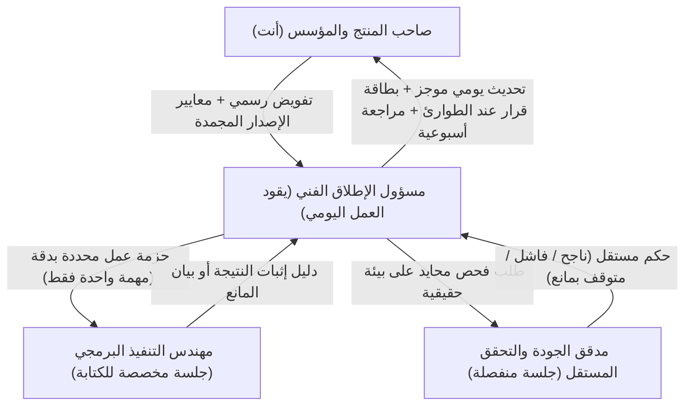
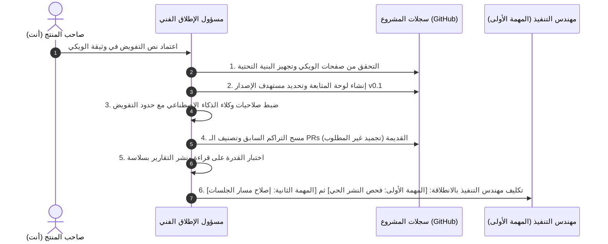
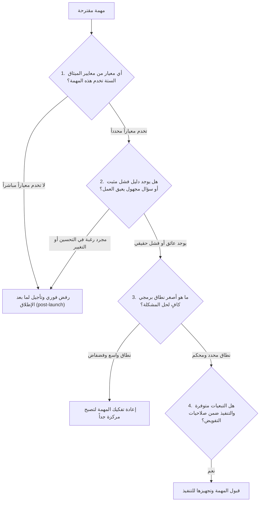
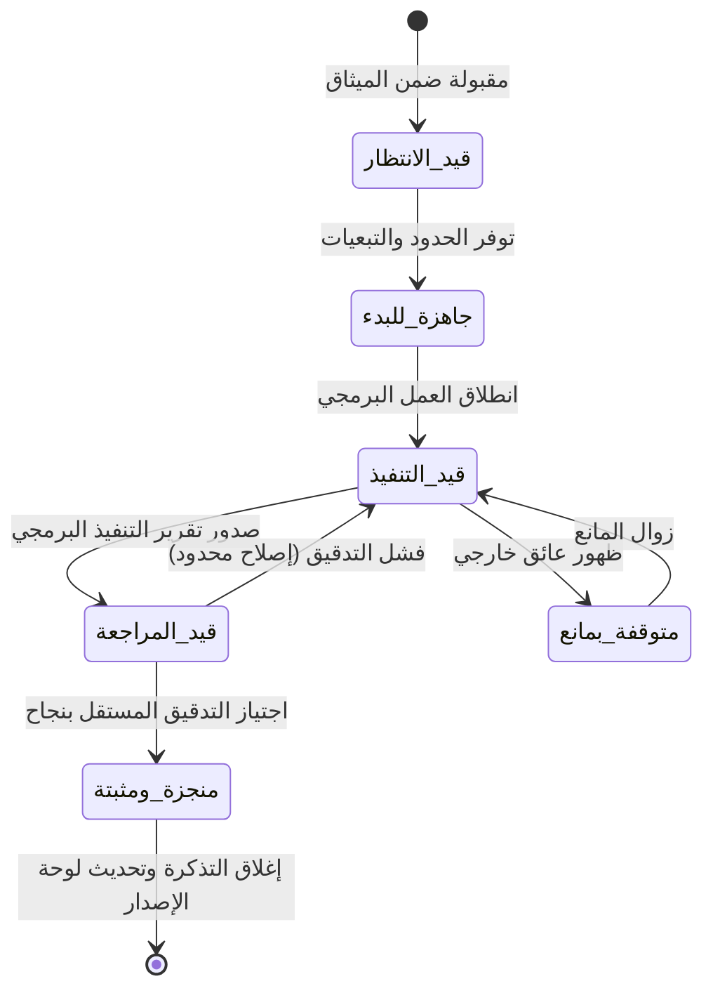

<div dir="rtl">

# دليل تشغيل مسار إنهاء وإطلاق «لبيب»
**تاريخ التحديث:** 30 سبتمبر 2026 | **رقم المراجعة:** 1.2 (النسخة المعربة والمنظمة)  
**طبيعة الوثيقة:** دليل عملي ملزم لإدارة وتشغيل الفريق التقني لإنهاء وإطلاق الإصدار التجريبي الأول `v0.1`.

---

> [!IMPORTANT]
> ### المبدأ الحاكم: مسار إغلاق الإصدار
> **مشروع لبيب دخل رسمياً في «وضع إنهاء وإطلاق الإصدار».**  
> الهدف الأوحد لكل دقيقة عمل هو: **تقليص المهام المتبقية للوصول إلى نسخة جاهزة للإطلاق**.  
> **يُمنع منعاً باتاً فتح أي عمل برمجي جديد أو إضافة ميزات أو تحسينات معمارية** ما لم تكن لازمة لتحقيق المعايير الستة المحددة في [ميثاق تسليم الإصدار الأول](./01_RELEASE_CONTRACT.md).

> [!TIP]
> ### كيف تبدأ وتدير يومك بـ 30 ثانية؟
> تبدأ يومك برسالة واحدة فقط توجهها إلى مسؤول الإطلاق:  
> **«تابع مسار إغلاق الإصدار من سجل المهام، وحدد لي المهمة النشطة حالياً وما هو المطلوب مني شخصياً إن وُجد.»**  
> *لا تبحث عن المهام في ذاكرتك، ولا تعيد شرح سياق المشروع يومياً. مسؤول الإطلاق يقرأ الواقع من سجلات المشروع على GitHub، ويعيد توثيق كل خطوة ودليل إليها.*

---

## 1. توزيع الأدوار والمسؤوليات: من يحاكي من؟ ومن يُشغّل من؟

لضمان عدم تحولك إلى "ناقل رسائل" بين أدوات الذكاء الاصطناعي، تم دمج مهام قيادة التسليم وإدارة الإصدار في واجهة واحدة: **مسؤول الإطلاق الفني**. أنت تتحدث معه فقط، وهو من يدير بقية الأطراف التقنية.



### مصفوفة الصلاحيات والحقوق

| الدور | من يؤديه عملياً؟ | ماذا يفعل فعلياً؟ (المسؤوليات الحصرية) | ما الممنوع عليه؟ (الخطوط الحمراء) |
|---|---|---|---|
| **صاحب المنتج والمؤسس** | **أنت (هاني)** | • يمنح التفويض التشغيلي المكتوب.<br>• يقرر تعديل القيمة الأساسية للنسخة أو ميزانية المشروع أو المخاطر الجوهرية.<br>• يعتمد أدلة معايير الإطلاق في الجلسة الأسبوعية.<br>• يملك حصرياً قرار الإطلاق للجمهور. | لا يتدخل في الجدولة الروتينية للمهام، ولا ينقل النصوص أو التقارير بين الأدوات يدوياً. |
| **مسؤول الإطلاق الفني** | **جلسة الإدارة والتنسيق** | • يقرأ السجل ويختار المهمة التالية بحسب الأولوية.<br>• يصيغ حزمة العمل ويوجه مهندس التنفيذ.<br>• يحل الاستفسارات التقنية ويجمع أدلة الإنجاز.<br>• يطلب التدقيق المستقل ويحدّث سجلات المشروع. | لا يغير معايير الميثاق، لا يوسع نطاق العمل، ولا يفترض صلاحيات نشر أو دمج لم تمنح له صراحة. |
| **مهندس التنفيذ** | **جلسة برمجة مخصصة** *(مثل Codex أو Jules)* | • ينفذ الكود البرمجي والاختبارات التابعة للمهمة المحددة فقط.<br>• يلتزم بالحدود البرمجية المرسومة له دون تجاوز.<br>• يرفق خطوات إعادة التجربة والأدلة الملموسة. | لا يختار المهمة التالية من تلقاء نفسه، ولا يفتح أي ملفات جانبية بغرض "التنظيف أو التحسين". |
| **مدقق الجودة المستقل** | **جلسة فحص منفصلة ومحايدة** | • يختبر السلوك الميداني للبرنامج من وجهة نظر المستخدم الحقيقي.<br>• يصدر حكماً مستقلاً: (ناجح / فاشل / متوقف بمانع).<br>• يوثق ما رآه بالأدلة والشاشات وخطوات التكرار. | لا يقوم بإصلاح الكود أثناء التفتيش، ولا يدقق عملاً قام بكتابته هو شخصياً. |

> [!NOTE]
> **ما معنى «الدور» هنا؟**  
> الدور ليس حساباً بشرياً إضافياً ولا وكيلاً يعمل بلا توقف في الخلفية، بل هو **جلسة عمل واضحة لها تعليمات ثابتة، مهمة واحدة محددة، صلاحيات موثقة، ومكان مخصص لحفظ نتاجها**.  
> استخدام أداة فحص داخل نفس جلسة البرمجة لا يعتبر تدقيقاً مستقلاً؛ لا يجوز لمن كتب الكود أن يكون هو نفسه القاضي الذي يمنح نفسه شهادة النجاح.

---

## 2. هندسة مصدر الحقيقة الواحد: أين يُحفظ كل شيء؟

القاعدة الذهبية لتنظيم العمل:
- **تتبع الحالة والقرارات يتم داخل تذاكر العمل (GitHub Issues).**
- **حفظ التقارير والأدلة المرجعية يتم في صفحات التوثيق (GitHub Wiki).**
- **مراجعة الأكواد والاختبارات تتم حصراً عبر طلبات الدمج (Pull Requests).**

```
مستودع المشروع (GitHub)
├── 📂 تذاكر العمل (Issues)
│   ├── #تذكرة التحكم: لوحة المتابعة الشاملة للإصدار (Release Control)
│   ├── #تذكرة الدورة الأسبوعية: أهداف الأسبوع الحالي (Sprint)
│   └── #تذكرة المهمة: حزمة العمل التنفيذية المفردة (Task)
├── 📂 طلبات الدمج (Pull Requests) للكود والاختبارات البرمجية فقط
└── 🌐 صفحات التوثيق المرجعي (GitHub Wiki)
    ├── الصفحة الرئيسية: الفهرس العام وروابط لوحة التحكم
    ├── دليل التشغيل: القواعد التنظيمية وقوالب العمل (هذه الوثيقة)
    ├── وثيقة التفويض: سجل الصلاحيات الممنوحة من المؤسس
    ├── معايير التقارير: القالب الإلزامي لتوثيق الأدلة
    ├── فهرس التقارير: سجل لكافة الفحوصات المنفذة
    └── تقارير التدقيق المستقلة: صفحات تفصيلية لكل مهمة وفحص أسبوعي
```

### أماكن التوثيق وصلاحيات التعديل

| المكان | المحتوى المخصص له | من يملك حق الكتابة؟ |
|---|---|---|
| **الصفحة الرئيسية للويكي** | بوابة الدخول: روابط لوحة التحكم، الدورة الأسبوعية، والمعايير. | مسؤول الإطلاق الفني حصراً. |
| **دليل التشغيل في الويكي** | هذا الدليل المعتمد والقوالب التنفيذية. | مسؤول الإطلاق (أي تغيير للحقوق يتطلب موافقتك). |
| **وثيقة التفويض في الويكي** | نص الصلاحيات التي اعتمدتها مع تاريخ الاعتماد. | مسؤول الإطلاق يسجل قرارك المعتمد. |
| **معايير التقارير في الويكي** | النموذج الموحد لكتابة التقارير وجمع الأدلة. | مسؤول الإطلاق الفني. |
| **فهرس التقارير في الويكي** | جدول مرتب يضم: المهمة، الكاتب، النتيجة، ورابط التقرير. | مسؤول الإطلاق الفني. |
| **صفحات التقارير الفردية** | تقارير التنفيذ البرمجي، نتائج التدقيق، والملخصات الأسبوعية. | كاتب التقرير يؤلفه، وينشره مسؤول الإطلاق. |
| **تذكرة متابعة الإصدار** | اللوحة الكبرى: حالة المعايير الستة، المهمة النشطة، والقرارات المعلقة. | مسؤول الإطلاق الفني فقط. |
| **تذكرة الدورة الأسبوعية** | هدف الأسبوع، مدته، قائمة مهامه المرتبة، وما أُغلق بنجاح. | مسؤول الإطلاق الفني. |
| **تذكرة المهمة الفردية** | حدود التعديل البرمجي، مهندس التنفيذ، المدقق، وروابط الأدلة. | مسؤول الإطلاق يدير حالتها، والوكلاء يعلقون فيها. |
| **طلب الدمج (PR)** | التعديل البرمجي الفعلي ومراجعة الكود واختباراته التلقائية. | مهندس التنفيذ، المدقق، ومن يملك حق الدمج. |

---

### تصنيفات العمل وعلامات التمييز (Labels)

1. **مستهدف الإصدار الرئيسي (Milestone):**  
   - يحمل اسماً واحداً ثابتاً: `Labeeb Release — v0.1`.
   - يضم فقط المهام البرمجية المقبولة التي تخدم الميثاق.
   - **تنبيه:** النسبة المئوية لإنجاز هذا المستهدف هي مجرد **مؤشر حسابي لعدد المهام المغلقة وليست مقياساً لجاهزية المنتج**. جاهزية المنتج تقاس باجتياز معايير الميثاق الميدانية.
2. **الدورة الأسبوعية (Sprint):**  
   - تُفتح كل أسبوع في تذكرة مستقلة بعنوان: `[الدورة الأسبوعية S01] الهدف المركز للأسبوع`.
   - الأسبوع هو نافذة لتنظيم الجهد وليس موعداً افتراضياً للإطلاق. إذا انتهى الأسبوع ومهمة ما لم تُغلق بدليل قطعي، تُنقل للأسبوع التالي مع توضيح السبب ولا تُغلق شكلياً.
3. **ثلاث علامات تمييز (Labels) حصرية:**  
   - `shipping`: للمهام المقبولة واللازمة حصراً للإصدار v0.1.
   - `post-launch`: لكل الأفكار الذكية والتحسينات المقترحة المؤجلة لما بعد إطلاق النسخة.
   - `waiting-founder`: يُوضع **فقط** عندما يتوقف العمل بانتظار قرار إداري أو مادي منك، ويزيله مسؤول الإطلاق فور إجابتك.

---

### محتويات لوحة متابعة الإصدار المركزية (Release Control)

تعرض اللوحة في رأسها وبشكل دائم:
- **حالة المشروع:** في مسار إغلاق الإصدار (Shipping Mode).
- **الميثاق المعتمد:** رابط الوثيقة ورقم نسختها المجمدة.
- **وثائق التشغيل والتفويض:** الروابط المباشرة في الويكي.
- **الدورة الأسبوعية الحالية:** روابط التذاكر والفلاتر.
- **المهمة النشطة حالياً:** رابط لمهمة واحدة فقط قيد العمل، أو عبارة «لا توجد مهمة نشطة».
- **جدول معايير الإصدار الستة:** لكل معيار حالته الفنية: (ناجح / فاشل / معلق بمانع) مع رابط الدليل، وبجانبه **حالة اعتمادك أنت**: (معتمد / مرفوض / قيد المراجعة).
- **الموانع الميدانية والقرارات المعلقة:** الإجراء المطلوب منك صراحة، أو عبارة «لا يوجد».
- **الخطوة التالية المباشرة فور الاستئناف.**

---

### القالب الموحد لتقارير الأدلة في الويكي

تُنشأ صفحات التقارير باسم موحد ومرتب:  
`Shipping-Report-YYYYMMDD-Issue-NNN-Executor-A01`  
*(حيث NNN يمثل رقم التذكرة، وA01 يمثل رقم المحاولة الأولى)*:

```markdown
# [عنوان النتيجة بوضوح شديد]
معرف التقرير: 
تذكرة المهمة: 
تذكرة الدورة الأسبوعية: 
المعيار المستهدف في الميثاق: [اسم المعيار الصريح]
الجهة الكاتبة / الجلسة: 
تاريخ ووقت الفحص: [بتوقيت محدد]
نوع التقرير: [تنفيذي / تدقيق مستقل / تشخيص عائق / ملخص أسبوعي]
النتيجة الفنية: [ناجح / فاشل / متوقف بمانع / لم يُختبر]
طبيعة الفحص: [فحص حي على الموقع / اختبارات آلية / قراءة كود]
المكونات وأرقام الإصدارات البرمجية (Commit SHAs): 
البيئة المستهدفة وبيانات النشر: 

## ما تم إثباته ميدانياً وأثره
[شرح مباشر: ما الذي تحقق بنجاح؟ وما الذي يسمح به هذا الإنجاز؟]

## خطوات إعادة التجربة خطوة بخطوة
[المدخلات الدقيقة، النصوص المدخلة، الإجراء المتخذ، والنتيجة المتوقعة مقابل ما حدث فعلياً]

## سجل الأدلة الملموسة
[روابط شاشات، سجلات الخادم، مع ذكر وقت التقاط كل دليل]

## حدود المعرفة الحالية
• حقائق مؤكدة بأدلة ملموسة (FACT):
• استنتاجات منطقية (INFERENCE):
• افتراضات قيد التحقق (ASSUMPTION):
• ما زال مجهولاً ويحتاج بحثاً (UNKNOWN):
• ما لم يشمله هذا الفحص:

## التعديلات البرمجية وطلبات الدمج
[رابط طلب الدمج PR مع ملخص الكود المعدل؛ وتقرير المدقق المستقل إن وُجد]

## الخطوة التالية المقترحة أو المانع المطلوب فكه
[إجراء محدد بدقة داخل نطاق المهمة فقط دون توسيع العمل]
```

---

## 3. بروتوكول التفعيل لمرة واحدة: كيف نبدأ المنظومة؟

عند اعتماد هذا المسار، يقوم مسؤول الإطلاق بتجهيز بيئة العمل عبر 6 خطوات متسلسلة دون إعادة فتح النقاش حول نطاق المشروع:



### نقطة الانطلاق الحتمية (ما سنبدأ به فوراً):
- **المهمة الأولى [معرفة النسخة المنشورة حياً - B-02]:** استخراج رقم الإصدار الفعلي (Commit SHA) المنشور حالياً على بيئة الإنتاج (`labeeb.io`) لجميع الخدمات والواجهات.
- **المهمة الثانية [إصلاح مسار جلسات الاستوديو - B-01]:** تشخيص وحل الخطأ الذي ظهر في المتصفح بتاريخ 30 سبتمبر:  
  `The route api/studio/sessions could not be found`  
  بأصغر تعديل برمجي ممكن، ثم إعادة فحص رحلة المستخدم على الموقع الحي.

---

### نص وثيقة التفويض الرسمي (Wiki: Shipping-Delegation)

يُعتمد هذا النص حرفياً في صفحة التوثيق ليصبح المرجع الإداري المنظم لصلاحيات الفريق:

```text
أقر أنا (صاحب المنتج والمؤسس) اعتماد هذا الدليل التشغيلي وميثاق تسليم الإصدار v0.1.

أفوض مسؤول الإطلاق الفني بالصلاحيات التالية:
1. ترتيب أولويات المهام الفنية داخل حدود ميثاق الإصدار.
2. إنشاء وتحديث تذاكر المهام والدورات الأسبوعية ولوحة التحكم.
3. إدارة ونشر صفحات التوثيق والتقارير الفنية.
4. تكليف مهندسي التنفيذ والمدققين المستقلين بالمهام ومتابعتهم.
5. الإجابة على الاستفسارات التقنية وحل العقبات داخل حدود المهمة.
6. قبول أدلة إغلاق المهام البرمجية بعد اجتيازها التدقيق المستقل.

أفوضه صراحة برفض أي عمل أو ميزة جديدة خارج نطاق الميثاق حتى لو اقترحتها أنا شخصياً؛
وأي تعديل جوهري أقرره يدوّن في السجل رسمياً ولا ينفذ كتوسع صامت.

حدود الصلاحيات الميدانية:
• التعديل البرمجي الروتيني: مسموح به داخل مهمة معتمدة تحقق معايير القبول.
• إنشاء طلبات الدمج (PR): مسموح به ضمن نطاق المهمة.
• دمج الكود إلى الفرع الرئيسي (Master): [مفوض للإصلاحات الروتينية المثبتة / يتطلب موافقتي].
• النشر إلى بيئة الإنتاج: [مفوض للإصلاحات المعتمدة / يتطلب موافقتي].
• نشر التقارير إلى الويكي: مسموح به وفق المعايير المعتمدة.

آلية الاعتماد الأسبوعي:
أعتمد أدلة معايير الإصدار في جلسة مراجعة أسبوعية واحدة؛ وتأخري في الرد يبقي حالة
الاعتماد (قيد المراجعة) ولا يعتبر موافقة ضمنية على الإطلاق، لكنه لا يوقف استكمال المهام الفنية المأذونة.

تعديل ميثاق الإصدار، اعتماد ميزانيات جديدة، المخاطر الجوهرية (أمنية، قانونية، تسريب بيانات)،
التعديلات المعمارية الكبرى، وقرار الإطلاق النهائي للجمهور.. تبقى جميعها من صلاحياتي الحصرية.
```

---

## 4. إيقاع اليوم العملي: كيف يُدار المشروع يومياً؟

### رسالة الصباح (ترسلها بكلمات ثابتة):
```text
تابع مسار إغلاق الإصدار في Labeeb.
المستودع: labeeb-io/labeeb
دليل التشغيل: [رابط الويكي]
وثيقة التفويض: [رابط التفويض]
لوحة متابعة الإصدار: [رابط التذكرة الكبرى]
الدورة الأسبوعية الحالية: [رابط الدورة]
الوقت المتاح مني اليوم: [مثلاً ساعتان للقرارات والاستفسارات].

اقرأ آخر التحديثات في السجل.
استأنف العمل على المهمة النشطة أولاً؛ وإذا اكتملت اختر المهمة التالية من الميثاق.
شغّل الفريق ضمن التفويض المعتمد، وحدّث سجلات المشروع، وأعطني الملخص اليومي السريع.
```

### عمل مسؤول الإطلاق فور استلام رسالتك:
1. يراجع التذكرة النشطة حالياً، تعليقاتها، وحالة طلب الدمج المرتبط بها.
2. يجيب على أي سؤال تقني يقف أمامه مهندس التنفيذ إن كان ضمن صلاحياته، أو يرفع لك "بطاقة قرار" إذا كان السؤال يمس النطاق أو الميزانية.
3. يضمن عدم فتح مهمة جديدة إلا بعد إغلاق المهمة الحالية بدليل ملموس.
4. يحدّث لوحة التحكم ويرسل لك الملخص اليومي المختصر.

### قالب الرد اليومي الموجز لمسؤول الإطلاق:
```text
المهمة النشطة حالياً: [رابط المهمة وحالتها].
سبب الأولوية اليوم: [المعيار المرتبط بها في ميثاق الإصدار].
الإجراء الميداني الجاري: [من يعمل على ماذا حالياً].
المطلوب منك شخصياً: [لا شيء / قرار محدد في تذكرة كذا / منح صلاحية وصول].
نقطة المتابعة القادمة: [توقيت وصول تقرير الفحص أو انتهاء التجربة].
```

---

## 5. بوابة قبول المهام وقاعدة «المهمة الواحدة فقط»

مسؤول الإطلاق هو حارس البوابة؛ يرفض دخول أي مهمة لا تجيب بنجاح عن **الأسئلة الأربعة الحاسمة**:



> [!CAUTION]
> ### القاعدة الحديدية: عدم فتح أكثر من مهمة في آنٍ واحد (WIP = 1)
> **لا يُسمح أبداً بالعمل على أكثر من مهمة واحدة في كامل المشروع** (برمجة ← مراجعة ← تدقيق ميداني).  
> لا ننتقل إلى إصلاح عطل جديد بينما العطل السابق بانتظار التحقق منه. إذا واجهت المهمة عائقاً لا يمكن حله حالياً، تُسجل بحالة (متوقفة بمانع)، ويُفتح مسار مخصص لفك هذا المانع تحديداً، مع بقاء المهمة الأصلية معلقة دون احتسابها منجزة.

---

## 6. حزمة العمل التنفيذية (كيف تُصاغ تذكرة المهمة للمبرمج؟)

لضمان عدم تشتت المبرمج، تُصاغ تذكرة العمل وفق هذا القالب المحكم:

```markdown
عنوان المهمة: [مسار الإطلاق] <النتيجة الوظيفية الواحدة المطلوبة بدقة>

لوحة متابعة الإصدار: [رابط تذكرة التحكم]
الدورة الأسبوعية: [رابط دورة الأسبوع]
مستهدف الإصدار: v0.1
علامات التمييز: shipping
المعيار المستهدف: [اسم المعيار الصريح من معايير الميثاق الستة]
حالة المهمة: جاهزة للبدء
المسؤول التقني: [اسم الحساب المسؤول]
مهندس التنفيذ: [اسم الأداة أو رابط الجلسة]
مدقق الجودة المستقل: [الجلسة المخصصة للتحقق]

## لماذا نحتاج هذه المهمة؟
[الدليل الملموس على فشل السلوك الحالي أو العائق الذي يمنع تقدم المعيار + الرابط]

## السلوك الوظيفي المطلوب حصراً
[وصف دقيق لما يجب أن يحدث؛ يُمنع الكلام العام مثل "إصلاح الخلل" أو "تحسين الأداء"]

## حدود الصلاحيات ونطاق التعديل
• المسارات والملفات المسموح بتعديلها:
• التعديلات الممنوعة منعاً باتاً (خارج النطاق):
• طبيعة العمل: [قراءة وتشخيص فقط / تعديل كود محدد].
• ضوابط النشر والدمج: وفق وثيقة التفويض المعتمدة.

## المتطلبات والبيئة التجريبية
• ما يجب أن يكون جاهزاً للبدء:
• البيئة المستهدفة للفحص: [الموقع الحي / بيئة التطوير].
• أرقام الإصدارات البرمجية ذات الصلة (Commit SHAs):

## دليل الإنجاز المطلوب لإغلاق المهمة
• خطوات ومدخلات قابلة للتكرار بالكامل:
• المخرجات الملموسة المتوقعة:
• كيف سيتم فحصها بعد النشر على الخادم؟ ومن سيقوم بذلك؟

## شروط التوقف والتصعيد الفوري
توقف عن العمل فوراً وارفع سؤالك إذا: [توسع النطاق / نقص صلاحية وصول / ظهور خطر أمني أو مالي].
```

---

## 7. دورة حياة المهمة من البداية وحتى الإغلاق



### توصيف مراحل سير العمل

| الحالة | المعنى الدقيق | دور مسؤول الإطلاق في هذه المرحلة |
|---|---|---|
| **قيد الانتظار** | مهمة مقبولة ومطابقة للميثاق، لكنها تنتظر دورها أو اكتمال متطلباتها. | ترتيب التبعيات وحفظ الأسبقية. |
| **جاهزة للبدء** | مهمة مكتملة الصياغة، بيئتها جاهزة، ويمكن للمبرمج استلامها فوراً. | إسناد التذكرة وتكليف مهندس التنفيذ. |
| **قيد التنفيذ** | عمل برمجي أو تشخيصي يجري تنفيذه حالياً على الكود. | الإجابة على التساؤلات وإزالة العوائق. |
| **قيد المراجعة** | المبرمج أنهى التعديل، والنتيجة بانتظار التدقيق المستقل أو الفحص الحي. | توجيه مدقق الجودة لإجراء الفحص المحايد. |
| **متوقفة بمانع** | العمل معطل مؤقتاً بسبب نقص صلاحية أو مشكلة خارج نطاق المهمة. | تشخيص المانع وتكليف من يملك حله. |
| **منجزة ومثبتة** | النتيجة اجتازت الفحص المستقل وثبت عملها على البيئة المحددة بدليل قاطع. | إغلاق التذكرة وتحديث نسبة تقدم معايير الميثاق. |

> [!IMPORTANT]
> **قاعدة ذهبية: الدمج لا يعني انتهاء المهمة!**  
> في طلبات الدمج (PR) نستخدم كلمة `Refs #تذكرة` ولا نستخدم `Fixes #تذكرة`، لأن **دمج الكود في المستودع لا يعني أبداً أن المهمة أغلقت**.  
> المهمة لا تُغلق إلا بعد رؤية الميزة تعمل فعلياً على البيئة الحية والتأكد من نجاحها بواسطة مدقق الجودة.

---

## 8. بروتوكول نشر ومزامنة التقارير الفنية

- **مركزية النشر لمنع التعارض:** يؤلف كل وكيل أو مهندس مسودة تقريره، ويتولى مسؤول الإطلاق مهمة حفظها في صفحات الويكي الرسمية لمنع حدوث تعارضات دمج في ملفات التوثيق.
- **التوثيق بالأدلة غير القابلة للشك:** كل تقرير يجب أن يذكر التوقيت الدقيق، البيئة المستخدمة، أرقام الإصدارات (Commit SHAs)، ومراجع الأدلة الرقمية (صور، سجلات الخادم). يُمنع الاعتماد على روابط مؤقتة تزول بمرور الوقت.
- **التعامل مع الماضي:** التقارير القديمة والمهام السابقة تبقى مؤرشفة كأدلة تاريخية، ولا يُعاد فتحها إلا إذا كان هناك سطر كود منها يلزمنا مباشرة لحل العوائق الحالية.

---

## 9. مصفوفة التصعيد للمؤسس: متى يرجع إليك مسؤول الإطلاق؟

للحفاظ على وقتك، يقتصر رجوع مسؤول الإطلاق إليك على **4 حالات حصرية فقط لا خامس لها**:
1. **قرار يمس القيمة الأساسية للمنتج أو نطاق العمل:** عندما تواجهنا مسألة لا يجيب عليها الميثاق الحالي، ونحتاج لتحديد ما إذا كنا سندعم هذا السلوك أم لا.
2. **قرار يتعلق بمخاطر جوهرية:** مخاطر أمنية، قانونية، تسريب بيانات حساسة، أو تكاليف استضافة واشتراكات مالية غير اعتيادية.
3. **مفاضلة معمارية مصيرية:** ظهور عائق تقني معقد لا يمكن حله إلا بتغيير جذري في بنية النظام لا يملك مسؤول الإطلاق صلاحية اتخاذه.
4. **قرار الإطلاق النهائي:** اكتمال المعايير الستة وجاهزية الأدلة لإعلان إطلاق الإصدار v0.1 للجمهور.

### قالب بطاقة اتخاذ القرار (تصلك عند الحاجة فقط):
```text
القرار المطلوب منك بدقة: [سؤال واحد مباشر ومحدد].
السبب والدليل الميداني: [رابط التقرير أو المشكلة].
توصية مسؤول الإطلاق: [الحل المقترح وأسبابه].
الخيار البديل: [البديل المتاح وما يترتب عليه من أثر].
الأثر المتوقع: [على الوقت / التكلفة / المخاطر].
ما الذي توقف حالياً بانتظار ردك:
ما الذي يستمر العمل عليه داخل الصلاحيات حالياً:
```

---

## 10. بروتوكول ختام اليوم والمراجعة الأسبوعية

### في نهاية اليوم (ترسل رسالة من 5 كلمات):
> **«أنهِ يوم العمل وثبّت نقطة الاستئناف.»**  
> يقوم مسؤول الإطلاق بحفظ الحالة الراهنة، تحديث لوحة التحكم، وإرسال تقرير من 3 أسطر:  
> **(ما تم إنهاؤه اليوم، ما تبقى للإصدار، وما هو المطلوب منك غداً).**

---

### المراجعة الأسبوعية للاعتماد (جلسة الـ 15 دقيقة):
ينشر مسؤول الإطلاق صفحة ملخص أسبوعي، ويعرض عليك جدولاً مقتضباً يضم المعايير التي اكتملت أدلتها الفنية خلال الأسبوع:

| البند | المعيار المستهدف في الميثاق | رابط التقرير والبيئة والإصدار | حكم مدقق الجودة المستقل | قرار اعتمادك أنت |
|:---:|:---:|:---:|:---:|:---:|
| **1** | المعيار الأول: بدء جلسة التحقق | [رابط تقرير الفحص الحي] | ناجح (PASS) | **`قيد المراجعة`** |
| **2** | المعيار الثاني: ظهور النتيجة وتتبعها | [رابط تقرير الفحص الحي] | ناجح (PASS) | **`قيد المراجعة`** |

**طريقة ردك تكون بكلمات سريعة وحاسمة:**
> `البند 1 معتمد، البند 2 مرفوض لسبب كذا، البند 3 يحتاج إيضاحاً إضافياً.`  
> *(موافقتك الأسبوعية مخصصة لمعايير الإصدار الكبرى، وتحررك من عبء مراجعة وتدقيق عشرات التفاصيل البرمجية الصغيرة التي أغلقت يومياً).*

---

## 11. علامات نجاح النظام (كيف نعرف أن آلية العمل نجحت فعلاً؟)

بعد أول دورة أسبوعية كاملة، يجب أن نتحقق من الآتي على أرض الواقع:
- [x] تم اختيار المهام وفق أولويات الميثاق دون أن تضطر أنت لتوزيع العمل بنفسك.
- [x] تقارير التنفيذ والتدقيق منشورة في الويكي، وتذاكر العمل محدثة بدقة.
- [x] تم إغلاق عائق حقيقي واختباره على الموقع الحي، أو توثيق مانع محدد بوضوح.
- [x] لم يصلك إلا القرارات الاستراتيجية التي تحتاج سلطتك الحصرية، وتوقفت تماماً عن لعب دور ناقل الرسائل.
- [x] أي جلسة عمل ذكاء اصطناعي جديدة تفتحها، تقرأ السجل وتعرف أين نقف وما هي الخطوة التالية دون أي شرح منك.
- [x] تم بنجاح رفض أي فكرة جديدة خارج الميثاق وتأجيلها لما بعد الإطلاق دون أي توسع صامت.

---

## 12. ملخص قرارات المراجعة والتطوير

1. **حسم المرجعية التوثيقية:** اعتماد صفحات GitHub Wiki للأدلة والتقارير المستقرة، وIssues لإدارة المهام والسبرينتات، بدلاً من حفظ تقارير التشغيل داخل كود المشروع.
2. **التفويض الصريح والرفض الإلزامي:** منح مسؤول الإطلاق حق رفض أي فكرة لا تخدم العقد، وتفويضه بإغلاق المهام الفنية بعد التدقيق المحايد، مع حصر قرار الإطلاق والمعايير الكبرى بيدك.
3. **التوافق البرمجي للوكلاء:** توثيق استثناءات واضحة لأدوات الذكاء الاصطناعي لإنشاء طلبات الدمج (PRs) وفحصها دون توقف بانتظار موافقات يدوية على التعديلات الروتينية.
4. **تجميد التراكم السابق:** عزل كافة التذاكر وطلبات الدمج المفتوحة القديمة (نحو 150 تذكرة وطلب دمج) وتأجيلها تلقائياً، والتركيز الحصري فقط على ما يعيق رحلة الإصدار الحالية.
5. **الانطلاقة الميدانية الحتمية:** البدء المباشر من العائقين المثبتين في فحص 30 سبتمبر:  
   - **المهمة الأولى:** استخراج هوية النسخة المنشورة على الخوادم (B-02).  
   - **المهمة الثانية:** حل خطأ مسار بدء جلسات الاستوديو في الواجهة الحية (B-01).

</div>
