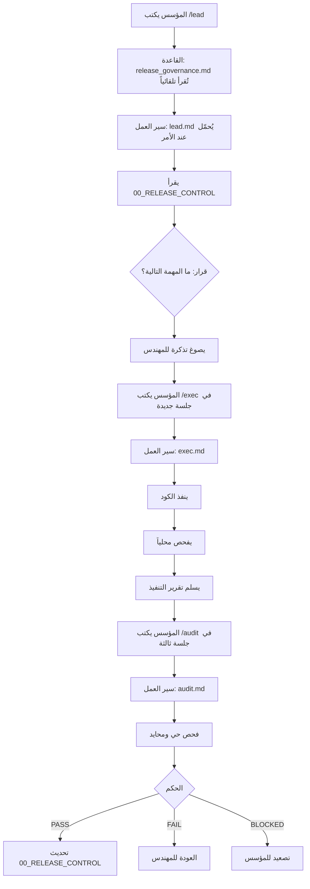
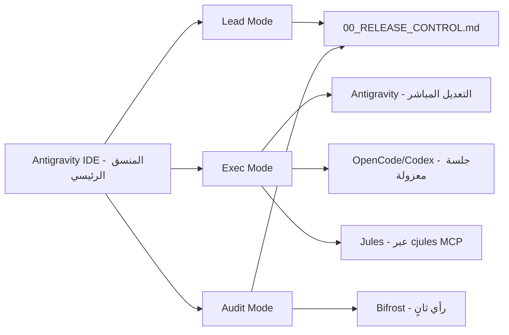

---

# دراسة تحسين سير العمل الوكيلي الديناميكي
# Agentic Workflow Optimization Study

**التاريخ:** 30 سبتمبر 2026  
**النطاق:** تحليل وتحسين البنية الحالية لسير العمل الوكيلي في مشروع لبيب v0.1  
**خطة التنفيذ المعتمدة:** [implementation_plan.md](./implementation_plan.md)  
**القيد:** دراسة فقط — لا تعديلات على الكود أو الملفات قبل اعتماد خطة التنفيذ  

---

## الجزء الأول: تشريح الوضع الحالي

### 1.1 جرد البنية الحالية

النظام الحالي يتكون من **أربع طبقات** مترابطة:

| الطبقة | الملفات | الوظيفة |
|---|---|---|
| **القواعد** (Rules) | [release_governance.md](../../.agent/rules/release_governance.md) | تُحمّل تلقائياً في كل جلسة — تعريف الأدوار ومحفزات التفعيل |
| **سير العمل** (Workflows) | [lead.md](../../.agent/workflows/lead.md), [exec.md](../../.agent/workflows/exec.md), [audit.md](../../.agent/workflows/audit.md) | سلوك كل دور عند تفعيله بأمر `/slash` |
| **البوابات** (Gates) | [prestart-approval.md](../../.agent/workflows/prestart-approval.md), [plan-approval.md](../../.agent/workflows/plan-approval.md), [soft-gate.md](../../.agent/workflows/soft-gate.md) | نقاط تفتيش إلزامية قبل البدء والتنفيذ |
| **الوثائق التشغيلية** | [00_RELEASE_CONTROL.md](./00_RELEASE_CONTROL.md), السبرينت، التقارير | حالة المشروع الحية ومسار الإطلاق |

### 1.2 خريطة التدفق الحالية



### 1.3 نقاط القوة في الوضع الحالي

| القوة | التفصيل |
|---|---|
| **فصل الأدوار واضح** | كل دور له ملف workflow مستقل بقواعد صارمة وممنوعات |
| **Zero-Boilerplate** | تفعيل بأمر `/lead` بدل نسخ برومبتات طويلة |
| **البوابات الثلاثية** | `prestart → plan → soft-gate` تمنع التنفيذ العشوائي |
| **WIP = 1** | انضباط المهمة الواحدة يمنع التشتت |
| **المرجعية المركزية** | `00_RELEASE_CONTROL.md` كمصدر حقيقة وحيد |
| **الربط بالمهارات** | كل دور مربوط بمهارات محددة بروابط مباشرة |

---

## الجزء الثاني: تشخيص الفجوات

### 2.1 الفجوة الجوهرية: الانتقالات يدوية بالكامل

> **المشكلة المركزية:** كل انتقال بين الأدوار يتطلب تدخل يدوي من المؤسس.

```
/lead → (المؤسس يقرأ المخرج) → (المؤسس يفتح جلسة جديدة) → /exec → (المؤسس يقرأ) → /audit
```

هذا يعني أن المؤسس هو **ناقل الرسائل** (Message Bus) بين الأدوار، وليس فقط **صاحب القرار**.

### 2.2 جدول الفجوات المحددة

| # | الفجوة | التأثير | الخطورة |
|:---:|---|---|:---:|
| **G-01** | **لا يوجد انتقال تلقائي بين الأدوار** | المؤسس يجب أن يكتب `/exec` يدوياً بعد `/lead` | 🔴 عالية |
| **G-02** | **لا يوجد hooks.json** | لا توجد أي فحوصات آلية قبل/بعد الأوامر | 🟡 متوسطة |
| **G-03** | **لا يوجد آلية لقراءة الحالة تلقائياً** | الوكيل لا يعرف حالة المشروع قبل أن يُطلب منه قراءتها | 🟡 متوسطة |
| **G-04** | **لا توجد آلية لتحديث 00_RELEASE_CONTROL تلقائياً** | بعد حكم PASS يجب على المؤسس أن يطلب التحديث يدوياً | 🟡 متوسطة |
| **G-05** | **تكرار audit.md = auditor.md و exec.md = executor.md** | ملفان متطابقان لكل دور بدون قيمة مضافة | 🟢 منخفضة |
| **G-06** | **manager-handoff.md مربوط بـ OpenCode فقط** | لا يغطي سيناريوهات التفويض لأدوات أخرى كـ Jules أو Codex | 🟡 متوسطة |
| **G-07** | **لا توجد آلية لإبقاء الوكيل نشطاً بعد التنفيذ** | الوكيل يتوقف بعد إتمام خطوة واحدة ولا يتابع التسلسل | 🔴 عالية |
| **G-08** | **لا توجد حماية ضد تعديل ملفات الحوكمة** | المهندس المنفذ يمكنه نظرياً تعديل `release_governance.md` | 🟡 متوسطة |

---

## الجزء الثالث: الحلول الديناميكية المقترحة

### 3.1 المستوى الأول: تحسينات فورية (بدون بنية جديدة)

هذه التحسينات تعمل داخل القدرات الحالية لـ Antigravity بدون أي أدوات خارجية:

#### أ. Hook: حارس الملفات المحمية (PreToolUse)

**الهدف:** منع المهندس المنفذ من تعديل ملفات الحوكمة أثناء دور `/exec`.

```json
{
  "governance-guard": {
    "PreToolUse": [
      {
        "matcher": "replace_file_content|multi_replace_file_content|write_to_file",
        "hooks": [
          {
            "type": "command",
            "command": ".agent/scripts/guard-governance-files.sh",
            "timeout": 5
          }
        ]
      }
    ]
  }
}
```

**السكريبت المرافق** (`guard-governance-files.sh`) سيقرأ `stdin` ويفحص إذا كان `TargetFile` يقع في مسارات محمية:
- `tasks/release-v0.1/00_RELEASE_CONTROL.md` (أثناء دور `/exec`)
- `.agent/rules/`
- `.agent/workflows/`
- `AGENTS.md`

ويعيد `{"decision": "deny", "reason": "..."}` عند المحاولة.

> **التأثير:** يحول الممنوعات النصية في `exec.md` إلى حواجز فعلية قابلة للتنفيذ. (يحل **G-08**)

#### ب. Hook: فحص تلقائي بعد كل تعديل كود (PostToolUse)

**الهدف:** تشغيل `pint --test` و `phpstan` تلقائياً بعد كل تعديل ملف PHP.

```json
{
  "auto-lint": {
    "PostToolUse": [
      {
        "matcher": "replace_file_content|multi_replace_file_content",
        "hooks": [
          {
            "type": "command",
            "command": ".agent/scripts/auto-lint-check.sh",
            "timeout": 30
          }
        ]
      }
    ]
  }
}
```

> هذا يلغي الحاجة لأن يتذكر الوكيل تشغيل الفحوصات — تصبح جزءاً من البنية التحتية.

#### ج. Hook: حقن السياق قبل كل استدعاء (PreInvocation)

**الهدف:** يقرأ `00_RELEASE_CONTROL.md` تلقائياً ويحقن المهمة النشطة والموانع كرسالة نظام.

```json
{
  "inject-release-context": {
    "PreInvocation": [
      {
        "type": "command",
        "command": ".agent/scripts/inject-release-state.sh",
        "timeout": 5
      }
    ]
  }
}
```

**المخرج المتوقع:**
```json
{
  "injectSteps": [
    {
      "ephemeralMessage": "المهمة النشطة: TASK-01 — إثبات استجابة مسار الجلسات. الموانع: BLK-01. الوضع: Shipping Mode."
    }
  ]
}
```

> **هذا يحل G-03 بالكامل:** الوكيل يعرف حالة المشروع فوراً دون أن يُطلب منه قراءتها.

---

### 3.2 المستوى الثاني: الانتقال شبه التلقائي بين الأدوار

#### أ. مفهوم "دورة الإطلاق الذكية" (Smart Release Cycle)

بدل ثلاث جلسات منفصلة يفتحها المؤسس يدوياً، نستخدم **جلسة واحدة** بسير عمل متكامل:

```
/release-cycle → [Lead يقرأ الحالة] → [يصوغ التذكرة] → [ينتقل لدور Exec] → [ينفذ] → [ينتقل لدور Audit] → [يفحص] → [يحدث اللوحة]
```

**التنفيذ المقترح:** إنشاء workflow جديد اسمه `release-cycle.md`:

```markdown
---
description: دورة إطلاق كاملة — Lead → Exec → Audit في جلسة واحدة مع بوابات موافقة.
---

# دورة الإطلاق المتكاملة (Smart Release Cycle)

## المرحلة 1: قراءة الحالة (Lead Mode)
1. اقرأ 00_RELEASE_CONTROL.md وحدد المهمة النشطة.
2. اقرأ السبرينت الحالي.
3. قدم الملخص التنفيذي (4 أسطر).
4. **بوابة موافقة:** "هل تريد المتابعة بتنفيذ هذه المهمة؟"

## المرحلة 2: التنفيذ (Exec Mode)
5. التزم بحدود التذكرة المحددة في المرحلة 1.
6. اقرأ CODING_GUIDELINES.md.
7. نفذ التعديل الجراحي.
8. شغّل الفحوصات المحلية.
9. قدم تقرير التنفيذ.
10. **بوابة موافقة:** "هل تريد المتابعة بالتدقيق؟"

## المرحلة 3: التدقيق (Audit Mode)
11. افحص النتيجة حياً.
12. وثّق الأدلة.
13. أصدر الحكم (PASS/FAIL/BLOCKED).
14. إذا PASS: حدّث 00_RELEASE_CONTROL.md.
```

**لماذا هذا أفضل؟**

| الجانب | الحالي (3 جلسات) | المقترح (جلسة واحدة) |
|---|---|---|
| عدد أوامر المؤسس | 3 (`/lead` + `/exec` + `/audit`) | 1 (`/release-cycle`) |
| نقل السياق | يدوي بين الجلسات | تلقائي داخل الجلسة |
| دور المؤسس | ناقل رسائل + صاحب قرار | صاحب قرار فقط |
| بوابات الأمان | نفسها | نفسها (محفوظة) |

> ⚠️ **المحذور:** هذا النموذج يعني أن نفس الوكيل يكتب الكود ويدققه. هذا مقبول **فقط** للمهام منخفضة-متوسطة المخاطر. للمهام عالية المخاطر، يجب الحفاظ على جلسة تدقيق منفصلة (أو استخدام Bifrost كمراجع مستقل).

#### ب. الانتقال الذكي باستخدام PostInvocation Hook

**الهدف:** عندما يُنهي الوكيل دور المهندس ويسلم تقرير التنفيذ، يُحقن تلقائياً سؤال "هل تريد الانتقال للتدقيق؟"

```json
{
  "smart-transition": {
    "PostInvocation": [
      {
        "type": "command",
        "command": ".agent/scripts/detect-role-completion.sh",
        "timeout": 5
      }
    ]
  }
}
```

السكريبت يقرأ `transcriptPath` ويبحث عن عبارات مثل "طلب تسليم المهمة" أو "تقرير التنفيذ"، فإذا وجدها:

```json
{
  "injectSteps": [
    {
      "userMessage": "المهندس أنهى التنفيذ. هل تريد الانتقال تلقائياً لجلسة التدقيق؟ (نعم/لا)"
    }
  ],
  "terminationBehavior": "force_continue"
}
```

> `force_continue` يمنع الوكيل من التوقف قبل أن يسأل المؤسس عن الخطوة التالية. (يحل **G-07**)

---

### 3.3 المستوى الثالث: التنسيق عبر أدوات متعددة (Multi-Agent Orchestration)

#### أ. التفويض الذكي عبر manager-handoff المحسّن

الملف الحالي [manager-handoff.md](../../.agent/workflows/manager-handoff.md) تم توجيهه للترسانة المتاحة فعلياً. المقترح يشمل ثلاثة مسارات:

| مسار التفويض | الأداة | متى يُستخدم | الميزة |
|---|---|---|---|
| **محلي** | Antigravity (الجلسة الحالية) | مهام بسيطة، فحص سريع | سياق كامل، بدون تبديل |
| **جلسة عاملة** | OpenCode / Codex | مهام تنفيذية محدودة النطاق | عزل، headless |
| **عن بعد** | Jules (عبر `cjules`) | مهام تحتاج repo access كامل | مستقل تماماً |

#### ب. سكريبت التفويض الذكي

```bash
#!/bin/bash
# .agent/scripts/smart-delegate.sh
# يقرأ stdin من الـ hook ويقرر مسار التفويض

TASK_JSON=$(cat)
RISK=$(echo "$TASK_JSON" | jq -r '.risk_level // "LOW"')
SCOPE=$(echo "$TASK_JSON" | jq -r '.scope // "local"')

if [ "$RISK" = "HIGH" ]; then
  echo '{"recommendation": "jules", "reason": "مهمة عالية المخاطر — تحتاج عزل كامل ومراجعة PR"}'
elif [ "$SCOPE" = "multi-file" ]; then
  echo '{"recommendation": "opencode", "reason": "نطاق متعدد الملفات — عزل الجلسة أفضل"}'
else
  echo '{"recommendation": "local", "reason": "مهمة محدودة — التنفيذ المحلي أسرع"}'
fi
```

#### ج. خارطة تكامل الأدوات



---

## الجزء الرابع: مراحل إضافية مقترحة

### 4.1 مرحلة "Pre-Flight Check" (قبل التنفيذ)

**الهدف:** فحص البيئة تلقائياً قبل بدء أي تنفيذ.

| الفحص | الأمر | الهدف |
|---|---|---|
| Docker services | `docker compose ps` | التأكد من أن الخدمات المطلوبة تعمل |
| Git status | `git status --porcelain` | التأكد من عدم وجود تعديلات غير ملتزمة |
| Branch check | `git branch --show-current` | التأكد من العمل على الفرع الصحيح |
| Disk space | `df -h /` | التأكد من وجود مساحة كافية |

**التنفيذ:** إضافة خطوة أولى في `exec.md`:

```markdown
## 0. فحص جاهزية البيئة (Pre-Flight)
- شغّل `docker compose ps` وتأكد من تشغيل الخدمات: api, frontend, scraper, opensearch, redis, postgres.
- شغّل `git status --porcelain` وتأكد من نظافة المستودع.
- إذا فشل أي فحص: **توقف فوراً** وأبلغ عن المانع.
```

### 4.2 مرحلة "Post-Audit Reconciliation" (بعد التدقيق)

**الهدف:** أتمتة ما يحدث بعد صدور حكم التدقيق.

| الحكم | الإجراء التلقائي |
|---|---|
| **PASS** | تحديث `00_RELEASE_CONTROL.md` → التحقق من المهمة التالية → عرض ملخص |
| **FAIL** | إنشاء تذكرة تصحيح تلقائياً → ربطها بتقرير الفحص → إرجاع WIP للمهندس |
| **BLOCKED** | تسجيل المانع في قسم الموانع → تحديد صاحب فك المانع → إيقاف الدورة |

### 4.3 مرحلة "Retrospective Snapshot" (لقطة ختامية)

**الهدف:** في نهاية كل دورة عمل ناجحة، حفظ ملخص مضغوط في Basic Memory.

```
Memory Note: "release-v0.1/TASK-XX-completion"
Observations:
  - completed_at: YYYY-MM-DD
  - audit_verdict: PASS
  - files_changed: [list]
  - time_to_complete: Xh
  - blockers_encountered: [list]
Relations:
  - closes [[TASK-XX]]
  - advances [[release-v0.1]]
```

---

## الجزء الخامس: نموذج التفعيل الديناميكي (بدل الاستدعاء اليدوي)

### 5.1 المشكلة

حالياً: المؤسس يجب أن يكتب `/lead` أو `/exec` أو `/audit` يدوياً.
المطلوب: الأدوار تتفعل ديناميكياً بناءً على **حالة المشروع** و**سياق المحادثة**.

### 5.2 ثلاثة أنماط للتفعيل الديناميكي

#### النمط 1: التفعيل بالسياق (Context-Triggered) — مُطبّق جزئياً

هذا موجود حالياً في `release_governance.md` تحت قسم "محفزات التفعيل":

```
عبارات مثل: "ما الخطوة التالية في الإطلاق؟" → تفعيل Lead
عبارات مثل: "نفذ المهمة التالية" → تفعيل Exec
```

**التحسين المقترح:** توسيع قائمة المحفزات وجعلها أكثر ذكاءً:

| المحفز الحالي | المحفز المقترح إضافته |
|---|---|
| `/lead` | "وين وصلنا؟"، "شو المهمة اللي بعدها؟"، "status"، "ملخص" |
| `/exec` | "خلينا نصلح هاد"، "ابدأ بالتنفيذ"، "implement"، "fix" |
| `/audit` | "شو صار؟ اشتغل؟"، "فحص"، "verify"، "test it" |

#### النمط 2: التفعيل بالحالة (State-Triggered) — جديد

**الفكرة:** سكريبت `PreInvocation` يقرأ حالة `00_RELEASE_CONTROL.md` ويُقترح الدور المناسب:

```
إذا: المهمة الحالية في حالة "قيد التنفيذ" ← اقترح /exec
إذا: تقرير تنفيذ جديد موجود ← اقترح /audit
إذا: حكم PASS صدر ← اقترح /lead للمهمة التالية
إذا: BLOCKED ← نبّه المؤسس بالمانع
```

**المخرج المتوقع من السكريبت:**

```json
{
  "injectSteps": [
    {
      "ephemeralMessage": "حالة المشروع: TASK-01 في مرحلة مكتمل التنفيذ. الإجراء المقترح: /audit لفحص النتيجة. هل تريد المتابعة؟"
    }
  ]
}
```

#### النمط 3: التفعيل بالسلسلة (Chain-Triggered) — متقدم

**الفكرة:** عندما ينتهي دور ما بنجاح، يُقترح الدور التالي تلقائياً. هذا يستخدم `PostInvocation` + `Stop` hook:

```
Lead ينتهي بتذكرة → يُقترح Exec
Exec ينتهي بتقرير → يُقترح Audit
Audit ينتهي بـ PASS → يُقترح Lead للمهمة التالية
Audit ينتهي بـ FAIL → يُقترح Exec بتذكرة تصحيح
```

> 🚨 **خطر التفعيل التسلسلي الكامل:** إذا لم توجد بوابة موافقة بين كل انتقال، يمكن أن يكتب الوكيل الكود ويدققه ويمرره بنفسه دون إشراف بشري. **يجب أن يبقى هناك `force_ask` أو سؤال صريح قبل كل انتقال.**

---

## الجزء السادس: التنفيذ المقترح — ملف hooks.json المتكامل

```json
{
  "governance-guard": {
    "PreToolUse": [
      {
        "matcher": "replace_file_content|multi_replace_file_content|write_to_file",
        "hooks": [
          {
            "type": "command",
            "command": ".agent/scripts/guard-governance-files.sh",
            "timeout": 5
          }
        ]
      }
    ]
  },
  "inject-release-context": {
    "PreInvocation": [
      {
        "type": "command",
        "command": ".agent/scripts/inject-release-state.sh",
        "timeout": 5
      }
    ]
  },
  "auto-lint": {
    "PostToolUse": [
      {
        "matcher": "replace_file_content|multi_replace_file_content",
        "hooks": [
          {
            "type": "command",
            "command": ".agent/scripts/auto-lint-check.sh",
            "timeout": 30
          }
        ]
      }
    ]
  },
  "smart-transition": {
    "PostInvocation": [
      {
        "type": "command",
        "command": ".agent/scripts/detect-role-completion.sh",
        "timeout": 5
      }
    ]
  },
  "prevent-premature-stop": {
    "Stop": [
      {
        "type": "command",
        "command": ".agent/scripts/check-cycle-complete.sh",
        "timeout": 5
      }
    ]
  }
}
```

### 6.1 السكريبتات المطلوبة

| السكريبت | الهدف | الأولوية |
|---|---|:---:|
| `guard-governance-files.sh` | حماية ملفات الحوكمة من التعديل أثناء التنفيذ | 🔴 عالية |
| `inject-release-state.sh` | حقن حالة المشروع الحية قبل كل استدعاء | 🔴 عالية |
| `auto-lint-check.sh` | فحص أسلوب الكود تلقائياً بعد كل تعديل | 🟡 متوسطة |
| `detect-role-completion.sh` | اكتشاف إتمام دور واقتراح الانتقال | 🟡 متوسطة |
| `check-cycle-complete.sh` | منع التوقف قبل اكتمال دورة العمل | 🟢 منخفضة |

---

## الجزء السابع: توصيات التحسين الهيكلية

### 7.1 دمج الملفات المكررة

| الملف | التوصية |
|---|---|
| `audit.md` = `auditor.md` | إبقاء `audit.md` فقط وجعل `auditor.md` يعمل كـ symlink أو حذفه |
| `exec.md` = `executor.md` | إبقاء `exec.md` فقط وجعل `executor.md` يعمل كـ symlink أو حذفه |

### 7.2 إعادة هيكلة release_governance.md

الملف الحالي يجمع بين:
1. تعريف الوضع التشغيلي
2. محفزات التفعيل التلقائي
3. السلوك الملزم لكل دور
4. تكامل المهارات

**المقترح — فصل المسؤوليات:**

| الجزء | المكان المقترح |
|---|---|
| وضع المشروع والروابط | يبقى في `release_governance.md` |
| محفزات التفعيل | ينتقل إلى `AGENTS.md` تحت قسم routing ديناميكي |
| السلوك الملزم | يبقى في ملفات الـ workflows |
| تكامل المهارات | يبقى في `release_governance.md` |

### 7.3 إضافة مسار `/release-cycle` موحد

كما شُرح في القسم 3.2.أ — هذا هو التحسين الأكبر تأثيراً:

**قبل:**
```
/lead → [قراءة يدوية] → /exec → [قراءة يدوية] → /audit → [تحديث يدوي]
= 3 أوامر + 3 قراءات يدوية = 6 تدخلات
```

**بعد:**
```
/release-cycle → [بوابة 1: موافقة] → [بوابة 2: موافقة] → [تحديث تلقائي]
= 1 أمر + 2 موافقات = 3 تدخلات (تخفيض 50%)
```

---

## الجزء الثامن: مصفوفة المخاطر والتخفيف

| المخاطر | الاحتمال | الأثر | التخفيف |
|---|:---:|:---:|---|
| الوكيل يكتب ويدقق بنفسه | عالٍ | 🔴 حرج | بوابة موافقة إلزامية قبل كل انتقال + Bifrost كمراجع للمهام العالية |
| سكريبتات الـ hooks تفشل صامتاً | متوسط | 🟡 متوسط | timeout محدد + fallback إلى السلوك اليدوي |
| PreInvocation يبطئ الجلسة | منخفض | 🟢 منخفض | timeout = 5s + قراءة ملف محلي فقط (لا شبكة) |
| `00_RELEASE_CONTROL.md` يصبح غير متسق | متوسط | 🔴 حرج | التحديث فقط عبر سكريبت موحد + git diff للتحقق |

---

## الجزء التاسع: خريطة التنفيذ المقترحة (بدون تنفيذ فعلي)

| الأولوية | الخطوة | الجهد | التأثير |
|:---:|---|:---:|:---:|
| **1** | إنشاء `hooks.json` مع `governance-guard` و `inject-release-state` | ساعة | 🔴 عالٍ |
| **2** | إنشاء سكريبتات `.agent/scripts/` الأساسية | ساعتان | 🔴 عالٍ |
| **3** | إنشاء workflow `/release-cycle` المتكامل | ساعة | 🔴 عالٍ |
| **4** | حذف الملفات المكررة (`auditor.md`, `executor.md`) | 10 دقائق | 🟢 منخفض |
| **5** | توسيع محفزات التفعيل في `release_governance.md` | 30 دقيقة | 🟡 متوسط |
| **6** | إضافة `auto-lint` hook | 30 دقيقة | 🟡 متوسط |
| **7** | إضافة `smart-transition` و `prevent-premature-stop` hooks | ساعة | 🟡 متوسط |

---

## الخلاصة التنفيذية

### الوضع الحالي
البنية الحالية **سليمة معمارياً** — الأدوار منفصلة، البوابات موجودة، المرجعية مركزية. لكنها **يدوية بالكامل** في الانتقالات بين الأدوار، مما يجعل المؤسس ناقل رسائل بدل صاحب قرار.

### التوصية المركزية
إضافة **طبقة hooks ذكية** تحقق ثلاثة أهداف:
1. **حماية** — منع المهندس من تعديل ملفات الحوكمة
2. **وعي** — حقن حالة المشروع تلقائياً في كل جلسة
3. **سلاسة** — اقتراح الانتقال بين الأدوار تلقائياً مع الاحتفاظ بالموافقة البشرية

### القاعدة الذهبية

> **الأتمتة تقترح، والمؤسس يقرر.**
>
> الهدف ليس إزالة البشر من الحلقة، بل إزالة العمل الميكانيكي (نقل الرسائل، تبديل الجلسات، تذكر الأوامر) وإبقاء **القرارات** فقط عند المؤسس.

---

هذه الدراسة تم تحويلها وتفكيكها إلى خطة تنفيذ معيارية: [implementation_plan.md](./implementation_plan.md).
بانتظار مراجعة المؤسس واعتماد الخطة للتنفيذ الفعلي.
