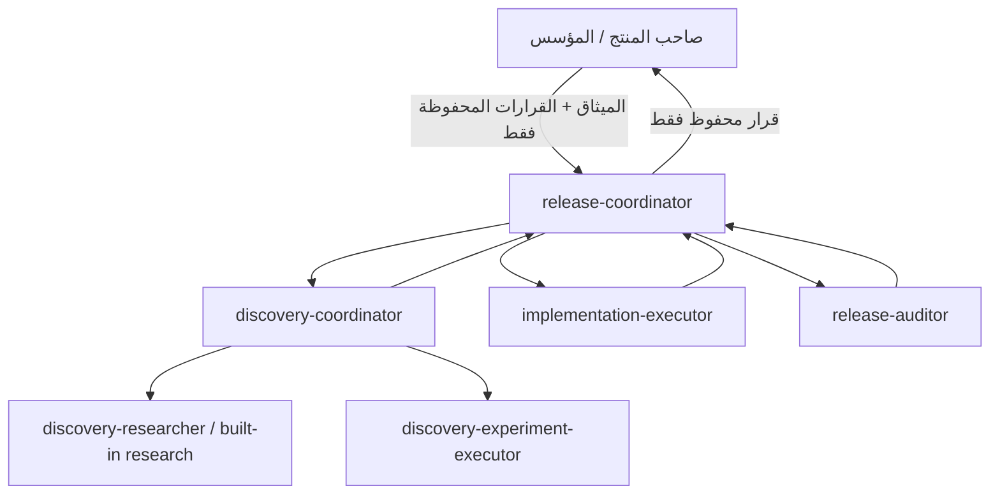

<div dir="rtl">

# لبيب — دليل التشغيل اليومي لمسار إنهاء وإطلاق الإصدار
**تاريخ التحديث:** 1 أكتوبر 2026 | **رقم المراجعة:** 2.0 — Agent-Native Shipping Mode  
**المرجع الأساسي:** [01_RELEASE_CONTRACT.md](./01_RELEASE_CONTRACT.md)

---

> [!IMPORTANT]
> ## المبدأ الحاكم
> مشروع لبيب في **Shipping Mode**. الهدف الأوحد هو تقليص العمل المتبقي لإطلاق `v0.1` بالدليل الميداني. لا تُفتح ميزة أو إعادة تصميم أو تحسين معماري لا يلزم مباشرة لتحقيق الميثاق المجمد.

> [!TIP]
> ## نقطة الدخول اليومية
> اكتب فقط: **`/shipping`** أو «تابع مسار إغلاق الإصدار».  
> يتولى `release-coordinator` قراءة الميثاق والحالة والأدلة، وتشغيل الوكلاء المختصين، وإعادتك فقط لقرار محفوظ للمؤسس إن وجد.

---

## 1. بنية التشغيل الجديدة: أنت لا تنقل الرسائل



### الأدوار

| الدور | المسؤولية | صلاحية التغيير |
|---|---|---|
| **المؤسس** | الميثاق، المخاطر الجوهرية، المعمارية الكبرى، Go/No-Go | قرارات محفوظة فقط |
| **Release Coordinator** | اختيار proof target، إدارة WIP=1، تفويض العمل، المصالحة، تحديث سجلات التشغيل | يكتب السجلات التشغيلية؛ لا يكتب product code |
| **Discovery Coordinator** | سؤال واحد Runtime-First، proof boundaries، Finding Card | قراءة فقط؛ mutation عبر executor منفصل |
| **Experiment Executor** | تجربة محلية محددة وقابلة للعكس وفق عقد | Runtime محلي فقط؛ لا كود/مigrations/deploy |
| **Implementation Executor** | أصغر إصلاح داخل Task Contract | كود محلي ضمن scope؛ لا push/merge/deploy/governance |
| **Release Auditor** | إعادة مسار الإثبات مستقلاً | قراءة/فحص؛ تقرير فقط |

### التنفيذ الأصلي أولاً
يستخدم المنسق **Native Antigravity Subagents** كخيار أول. إذا لم تتوفر `invoke_subagent` في السطح الحالي، يستخدم `Orchestrator` داخلياً كـfallback بدل إعادة المستخدم لنقل حزم العمل يدوياً.

---

## 2. مصادر الحقيقة

1. **الميثاق المجمد:** [01_RELEASE_CONTRACT.md](./01_RELEASE_CONTRACT.md)
2. **الحالة التشغيلية وآخر الأدلة:** [00_RELEASE_CONTROL.md](./00_RELEASE_CONTROL.md)
3. **التفويض:** [03_DELEGATION_RECORD.md](./03_DELEGATION_RECORD.md)
4. **السبرينت:** سياق أسبوعي وليس مصدر مهمة إلزامي.
5. **التقارير:** [reports/](./reports/) هي سجل الأدلة الدائمة.
6. **الكود/Runtime:** يستخدمان لإثبات السؤال الحالي فقط، وليس لإعادة فتح تصميم المنصة.

قاعدة الأولوية عند التعارض: الميثاق والتفويض الحاليان > الدليل Runtime الحالي > سجل الحالة > السبرينت > الخطط التاريخية.

---

## 3. دورة العمل اليومية

### أ. `/shipping`
يقوم `release-coordinator` بالآتي:
1. يقرأ الميثاق والحالة وآخر دليل مرتبط.
2. يحدد **أول proof boundary غير محسوم** في مسار الإصدار الحالي.
3. يختار أقل إجراء حاسم:
   - فحص Runtime مباشر؛
   - `/discovery` لسؤال مجهول؛
   - تنفيذ Task Contract عند فشل مثبت؛
   - `/audit` لإعادة الإثبات مستقلاً.
4. يكمل تلقائياً داخل التفويض؛ لا يتوقف لإعادة تسليم الرسائل للمؤسس.
5. يحدث Release Control والسبرينت/التقرير عندما تتغير الحالة بدليل.

### ب. الرد المختصر للمؤسس
```text
المستهدف الحالي:
الحالة المرصودة:
الإجراء الجاري/المكتمل:
الحالة الفنية: PASS | FAIL | BLOCKED | UNKNOWN | IN_PROGRESS
المطلوب منك: لا شيء | قرار محفوظ واحد
الخطوة التلقائية التالية:
```

---

## 4. بوابة العمل وWIP = 1

لا تتحول ملاحظة إلى Task إلا إذا تحققت الشروط التالية:
1. أثر مباشر على ميثاق v0.1 أو تمهيد ضروري مثبت.
2. فرق مرصود بين المتوقع والفعلي.
3. مدخل/هوية تشغيل قابلة لإعادة التكرار.
4. أول failure boundary معروف، أو تشخيص محدود واضح إذا السبب غير محسوم.
5. Acceptance يعيد نفس proof path الأصلي.
6. لا توجد مهمة نشطة مكررة.
7. WIP يبقى واحداً.

### Finding Gate الجديد
```text
Finding
  -> Release Coordinator Delegation Check
       -> Routine + in-contract + delegated risk: Bounded Task automatically
       -> Reserved founder decision: Decision Card
```

لا يحتاج كل Finding موافقة المؤسس. التصعيد محصور بالقسم 8 أدناه.

---

## 5. بروتوكول الإثبات والتجريب (Evidence-Driven Experimentation)

### أ. الميثاق هو المرجع
ينطلق العمل من رحلة القبول في [01_RELEASE_CONTRACT.md](./01_RELEASE_CONTRACT.md). Release Control يسجل الواقع ولا يفرض سبباً أو حلاً لمجرد أنه مكتوب تاريخياً.

### ب. Proof Boundary Ledger
كل Discovery/Audit يحافظ على:
```yaml
proof_ledger:
  target_path: []
  boundaries:
    - name: ...
      state: OBSERVED_PASS | OBSERVED_FAIL | NOT_OBSERVED | BLOCKED
      evidence: []
  first_unproven_boundary: ...
  canonical_entrypoint: KNOWN | UNKNOWN
  stable_identity: ...
```
لا يجوز أن يكون الحكم أوسع من الحدود التي تمت ملاحظتها.

### ج. Runtime-First
المسار الافتراضي:
```text
minimal release context
-> decisive runtime probe
-> observe same execution identity
-> targeted diagnosis only on mismatch
-> verdict
```
`Basic Memory` و`wiki` و`GitNexus` والكود أدوات شرطية، وليست مراحل إلزامية قبل Runtime.

### د. Canonical Entrypoint + Experiment Fidelity
- قبل التجربة الرئيسية، يثبت الوكيل نقطة دخول واحدة مستخدمة فعلياً الآن.
- لا يجوز استخدام shortcut downstream ثم ادعاء نجاح الرحلة upstream.
- إن بقيت نقطة الدخول مجهولة، يكون الحكم `UNKNOWN` أو `BLOCKED` بدليل المعلومة الناقصة.

### هـ. الصلاحيات
- **Read-only probes:** مفوضة تلقائياً ضمن المهمة.
- **Bounded local experiment:** يمكن لـ`release-coordinator` تفويض تجربة محلية واحدة قابلة للعكس لـ`discovery-experiment-executor` عندما لا تمس الكود/المخطط/النشر/البنية التحتية.
- **Production state-changing probe:** يحتاج عقداً محدداً وقرار المؤسس إذا لم يكن أصلاً جزءاً من تنفيذ روتيني مفوض ومجاز.
- Timeout لا يبرر retry عشوائي؛ يجب المصالحة بالمعرف أولاً.

### و. أحكام Discovery
- `WORKING_LOCALLY`
- `PROVEN_LOCAL_ISSUE`
- `AWAITING_EXPERIMENT_APPROVAL`
- `BLOCKED`
- `UNKNOWN`
- `OUT_OF_SCOPE`

نجاح capability محلية لا يرفع معيار الإصدار الحي تلقائياً.

---

## 6. التنفيذ البرمجي

التنفيذ يبدأ فقط بعقد مهمة مقيد:
```yaml
task_contract:
  task_id: ...
  release_criterion: ...
  observed_failure: ...
  first_failure_boundary: ...
  allowed_scope: []
  forbidden_scope: []
  expected_behavior: ...
  acceptance_probe: ...
  validation: []
  environment: ...
  stop_conditions: []
```

`implementation-executor`:
- يثبت الواقع المطلوب فقط؛
- يعيد استخدام الموجود قبل إضافة abstraction جديدة؛
- لا ينظف الكود المحيط؛
- لا يغير governance؛
- لا push/merge/deploy؛
- يعيد actual changed files + validation evidence.

إن ناقض الواقع عقد المهمة مادياً، يرجع للمنسق ولا يرتجل إعادة تصميم.

---

## 7. التدقيق المستقل والإغلاق

بعد التنفيذ:
1. المنسق لا يعتمد ملخص العامل كدليل.
2. يستدعي `release-auditor` بجلسة مستقلة وبـoriginal proof path.
3. المدقق يعيد جمع الدليل ويصدر: `PASS | FAIL | BLOCKED | UNKNOWN`.
4. عند `FAIL`:
   - إصلاح مستهدف لنفس worker/session إذا بقي العقد صحيحاً؛
   - عودة إلى Discovery إذا انهار الافتراض أو تغيرت الحدود.
5. عند `PASS` المدعوم بالدليل المطلوب، يغلق المنسق المهمة الروتينية ويحدث السجلات.
6. **`Merged != DONE`**، ونجاح الاختبارات المحلية لا يساوي Release Criterion PASS.

---

## 8. مصفوفة التصعيد للمؤسس — أربع حالات فقط

1. تغيير قيمة المنتج أو ميثاق/nطاق v0.1.
2. مخاطر أمنية/قانونية/سرية بيانات أو التزام مالي غير اعتيادي.
3. تغيير معماري كبير أو استبدال منظومة رئيسية.
4. الاعتماد النهائي للإطلاق العام `Go / No-Go`.

يستمر العمل الفني المسموح أثناء انتظار القرار حيث لا يعتمد عليه مباشرة.

### بطاقة القرار
```text
القرار المطلوب:
الدليل:
توصية Release Coordinator:
البديل:
الأثر:
ما المتوقف بانتظار القرار:
ما المستمر تلقائياً:
```

---

## 9. الأوامر الحديثة

| الأمر | الاستخدام |
|---|---|
| `/shipping` | الواجهة الرئيسية؛ يدير الدورة كاملة |
| `/lead` أو `/delivery-lead` | حالة/توجيه Release Coordinator، مع إمكانية الاستمرار |
| `/discovery` | Runtime-First bounded discovery |
| `/exec` أو `/executor` | تنفيذ Task Contract قائم |
| `/audit` أو `/auditor` | تدقيق مستقل لعقد إثبات قائم |
| `/release-cycle` | Alias توافق خلفي لـ`/shipping` |

الأوامر القديمة `/manager-handoff`, `/prestart-approval`, `/soft-gate`, `/plan-approval` لم تعد مراحل مستقلة؛ وظائفها موزعة على Coordinator + Rules + Hooks + Task/Experiment Contracts.

---

## 10. المراجعة الأسبوعية

يعرض المنسق الأدلة التي اكتملت فنياً لكل معيار. اعتماد المعيار النهائي يبقى للمؤسس حسب التفويض، وقرار إطلاق الجمهور يبقى حصرياً له.

---

## 11. الروابط
- [00_RELEASE_CONTROL.md](./00_RELEASE_CONTROL.md)
- [01_RELEASE_CONTRACT.md](./01_RELEASE_CONTRACT.md)
- [03_DELEGATION_RECORD.md](./03_DELEGATION_RECORD.md)
- [04_ROLE_PROMPTS.md](./04_ROLE_PROMPTS.md)
- [AGENT_SYSTEM_ARCHITECTURE.md](./AGENT_SYSTEM_ARCHITECTURE.md)
- [CHANGELOG.md](./CHANGELOG.md)
- [sprints/sprint_S01.md](./sprints/sprint_S01.md)

</div>
