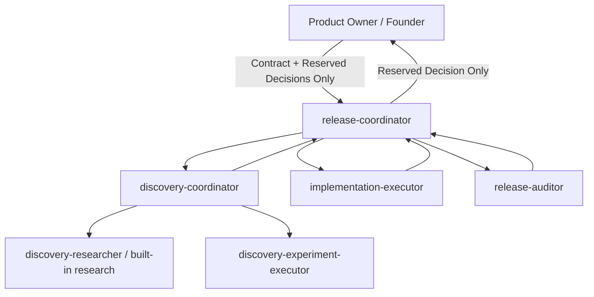

# Shipping Mode Daily Operating Manual

**Last Updated:** [YYYY-MM-DD] | **Revision:** 2.1 — Agent-Native Shipping Mode  
**Core Reference:** [01_RELEASE_CONTRACT.md](./01_RELEASE_CONTRACT.md)

---

> [!IMPORTANT]
> ## Governing Principle
> The project operates in **Shipping Mode**. The sole objective is closing remaining gaps to release `v0.1` backed by empirical proof. No new features, redesigns, or architectural refactors are introduced unless strictly required to satisfy the frozen release contract.

> [!TIP]
> ## Daily Entrypoint
> Trigger: **`/shipping`** or "continue shipping release".  
> The `release-coordinator` reads the contract, status, and latest evidence, orchestrates specialized subagents, and returns to the founder only for reserved decisions.

---

## 1. Operating Architecture: Automated Agent Coordination



### Agent Roles & Boundaries

| Role | Core Responsibility | Authority Boundary |
|---|---|---|
| **Founder** | Release contract, material risks, major architecture, final Go/No-Go | Reserved decisions only |
| **Release Coordinator** | Selects proof target, enforces WIP=1, delegates work, reconciles results, updates records | Writes operational logs; no production code |
| **Discovery Coordinator** | Single runtime-first question, proof boundaries, Finding Card | Read-only; mutations via separate experiment executor |
| **Experiment Executor** | Bounded, reversible local experiment under exact contract | Local runtime only; no code/migrations/deploy |
| **Implementation Executor** | Minimal targeted fix inside approved Task Contract | Local code in scope; no push/merge/deploy/governance |
| **Release Auditor** | Re-executes original proof path independently | Read-only inspection; generates audit report |

---

## 2. Hierarchy of Truth

1. **Frozen Release Contract:** [01_RELEASE_CONTRACT.md](./01_RELEASE_CONTRACT.md)
2. **Operational Status & Evidence:** [00_RELEASE_CONTROL.md](./00_RELEASE_CONTROL.md)
3. **Delegation Record:** [03_DELEGATION_RECORD.md](./03_DELEGATION_RECORD.md)
4. **Current Sprint:** Contextual guide, not an independent requirement source.
5. **Audit Reports:** [reports/](./reports/) provide persistent verification proof.
6. **Code / Runtime:** Used strictly to prove the active question, not to reopen architecture.

Conflict Priority: Current Contract & Delegation > Current Runtime Evidence > Release Control > Sprint Plans > Historical Notes.

---

## 3. Daily Execution Cycle

### A. `/shipping` Flow
The `release-coordinator` autonomously performs:
1. Reads the contract, control status, and relevant proof logs.
2. Identifies the **first unproven boundary** along the active release path.
3. Selects the most decisive, minimal action:
   - Direct runtime probe.
   - `/discovery` for an unknown boundary.
   - `/exec` with Task Contract for a proven failure.
   - `/audit` for independent verification.
4. Executes autonomously within delegated scope without manual message relaying.
5. Updates Release Control and sprint records when status changes with proof.

### B. Concise Founder Briefing Format
```text
Current Target:
Observed State:
Action in Progress / Completed:
Technical Status: PASS | FAIL | BLOCKED | UNKNOWN | IN_PROGRESS
Action Required from Founder: None | Single Reserved Decision
Automatic Next Step:
```

---

## 4. Finding Gate & Single Work-In-Progress (`WIP = 1`)

A finding converts to a Task Contract only when:
1. Direct impact on a v0.1 release criterion or mandatory prerequisite.
2. Reproducible divergence between expected and actual runtime behavior.
3. Explicit execution identity and reproducible steps.
4. Earliest failure boundary identified.
5. Acceptance probe re-runs the original proof path.
6. No duplicate active tasks exist (`WIP = 1`).

---

## 5. Evidence-Driven Runtime Discovery

### Proof Boundary Ledger
Every discovery and audit phase maintains a structured ledger:
```yaml
proof_ledger:
  target_path: []
  boundaries:
    - name: ...
      state: OBSERVED_PASS | OBSERVED_FAIL | NOT_OBSERVED | BLOCKED
      evidence: []
  first_unproven_boundary: ...
  canonical_entrypoint: KNOWN | UNKNOWN
  stable_identity: ...
```
Verdicts cannot exceed the boundaries directly observed.

### Discovery Outcomes
- `WORKING_LOCALLY`
- `PROVEN_LOCAL_ISSUE`
- `AWAITING_EXPERIMENT_APPROVAL`
- `BLOCKED`
- `UNKNOWN`
- `OUT_OF_SCOPE`

---

## 6. Implementation & Task Contract

Code edits begin strictly with a bounded Task Contract:
```yaml
task_contract:
  task_id: ...
  release_criterion: ...
  observed_failure: ...
  first_failure_boundary: ...
  allowed_scope: []
  forbidden_scope: []
  expected_behavior: ...
  acceptance_probe: ...
  validation: []
  environment: ...
  stop_conditions: []
```

`implementation-executor` adheres to:
- Fixing the exact observed failure only.
- Reusing existing abstractions rather than inventing new frameworks.
- No peripheral refactoring or governance changes.
- No push, merge, or deployment actions.

---

## 7. Independent Audit & Closure

Following implementation:
1. The coordinator never relies on worker self-reporting as proof.
2. An independent session executes `release-auditor` along the original proof path.
3. Auditor returns: `PASS | FAIL | BLOCKED | UNKNOWN`.
4. On `PASS` with verified evidence, the coordinator closes the task and updates records.
5. Note: `Merged != DONE`; local tests passing do not equal Release Criterion PASS.

---

## 8. Founder Escalation Matrix (Strictly 4 Cases)

1. Alteration of core product value, release scope, or contract criteria.
2. Material security, compliance, data-privacy, or financial risks.
3. Major architectural replacement of primary subsystems.
4. Final public release Go / No-Go decision.

---

## 9. Modern Slash Commands

| Command | Usage |
|---|---|
| `/shipping` | Main entrypoint; executes full coordination cycle |
| `/lead` or `/delivery-lead` | Check status, guidance, or trigger release cycle |
| `/discovery` | Bounded runtime-first investigation |
| `/exec` or `/executor` | Execute an approved Task Contract |
| `/audit` or `/auditor` | Independent verification of proof path |
| `/release-cycle` | Backward compatibility alias for `/shipping` |

---

## 10. Documentation References
- [00_RELEASE_CONTROL.md](./00_RELEASE_CONTROL.md)
- [01_RELEASE_CONTRACT.md](./01_RELEASE_CONTRACT.md)
- [03_DELEGATION_RECORD.md](./03_DELEGATION_RECORD.md)
- [04_ROLE_PROMPTS.md](./04_ROLE_PROMPTS.md)
- [sprints/sprint_S01.md](./sprints/sprint_S01.md)
